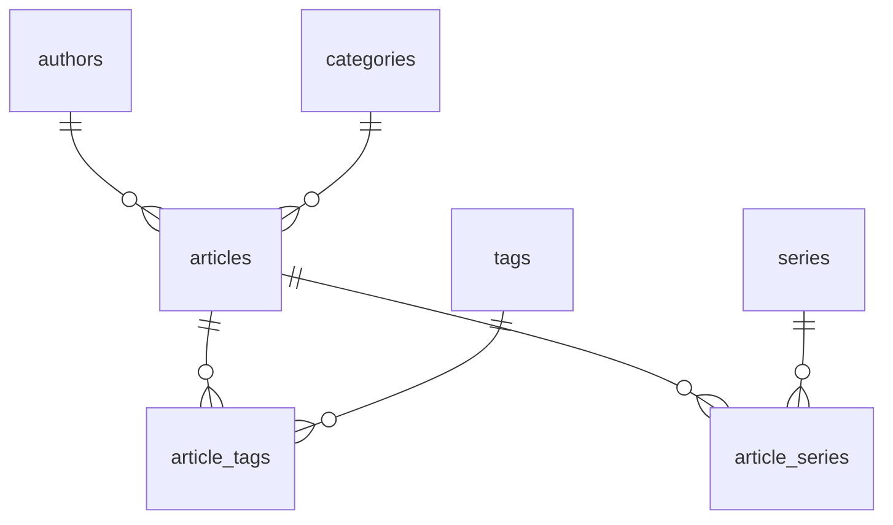
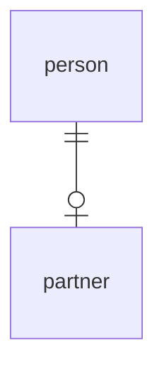
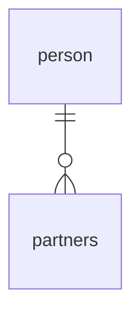
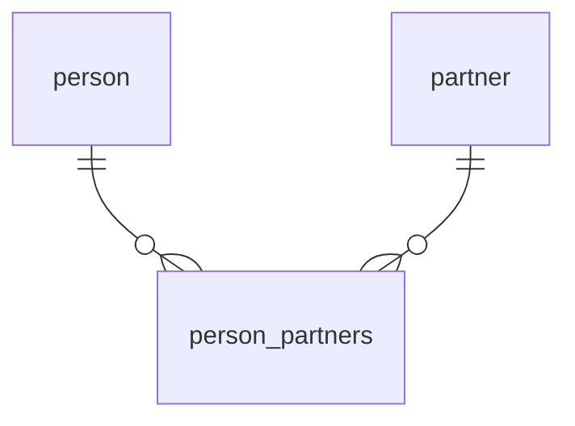

# データベース構造と設計

## RDBMSとNoSQL

今回使用するデータベースは、PostgreSQLというRDB(RDBMS)を使用します。

RDBMSは、RDBMSとNoSQLの2種類があります。

- RDBMS(RDB): MySQL, PostgreSQL, Oracle, SQL Server, SQLiteなど

- NoSQL: MongoDB, Redis, Cassandra, HBase, Neo4jなど

それぞれ様々な特徴を持ちますが、今回はRDBMSを使用してwebアプリケーションを作成していこうと考えています。

## データベースの構造

データベースは、データベースサーバと呼ばれるサーバ上で動作し、データベースを管理するためのソフトウェアです。データベースは複数のテーブルを持ち、テーブルは複数のカラムを持ちます。
テーブル同士が関連を持つことを、一般的にリレーションと呼びます。

## ER図

ER図は、データベースの構造を図で表したものです。ER図を作成することで、データベースの構造を可視化することができます。



## リレーション

基本的にリレーションには、1対1、1対多、多対多の3種類があります。データベースでは、この3種類のリレーションを組み合わせて設計します。
サービスの特性や要件によって、テーブル構造やリレーションは異なるので、それぞれのサービスに合わせて設計していきます。

### 1対1

例）1人の人間は、1人のパートナーを持つことができます。1人のパートナーは、1人の人間を持つことができます。



Railsでの実装例

```ruby
class Person < ApplicationRecord
  has_one :partner
end

class Partner < ApplicationRecord
  belongs_to :person
end
```

### 1対多

例）1人の人間は、複数のパートナーを持つことができます。1人のパートナーは、1人の人間を持つことができます。



Railsでの実装例

```ruby
class Person < ApplicationRecord
  has_many :partners
end

class Partner < ApplicationRecord
  belongs_to :person
end
```

### 多対多

例）1人の人間は、複数のパートナーを持つことができます。1人のパートナーは、複数の人間を持つことができます。



Railsでの実装例

```ruby
class Person < ApplicationRecord
  has_many :person_partners
  has_many :partners, through: :person_partners
end

class Partner < ApplicationRecord
  has_many :person_partners
  has_many :people, through: :person_partners
end

class PersonPartner < ApplicationRecord
  belongs_to :person
  belongs_to :partner
end
```
