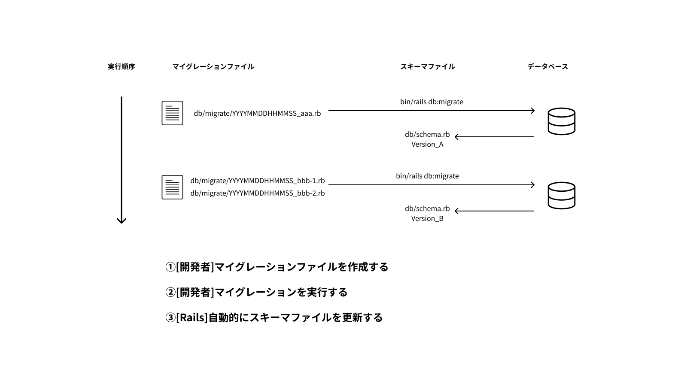

# マイグレーション

## マイグレーションとは

マイグレーションとは、データベースのスキーマを変更することです。
データベースのスキーマとは、データベースの構造のことです。

例えば、テーブルの追加や削除、カラムの追加や削除、インデックスの追加や削除などです。

## マイグレーションの図解

スライドにも記載していますが、マイグレーションは基本的に以下の手順で行います。

1. マイグレーションファイルを作成する
2. マイグレーションファイルを実行する
3. データベースのスキーマが変更される

<!-- ## マイグレーションの注意点

### データベースのスキーマを変更するときは必ずマイグレーションを使う

### バージョン管理

### 実際のデータが消える場合があることに注意する -->

## マイグレーションで使用するデータ型

| 型 | 説明 |
|----|------|
| `:binary` | バイナリデータを保存するために使用します |
| `:boolean` | 真偽値（真または偽）を保存するために使用します |
| `:date` | 日付データを保存するために使用します |
| `:datetime` | 日付と時間のデータを保存するために使用します |
| `:decimal` | 有理数を保存するために使用し、小数点数の精度を指定することができます |
| `:float` | 浮動小数点数を保存するために使用します |
| `:integer` | 整数データを保存するために使用します |
| `:bigint` | 大きな整数データを保存するために使用します |
| `:primary_key` | 主キーを作成するために使用します |
| `:references` | 別のモデルへの参照（外部キー）を作成するために使用します |
| `:string` | 短い文字列データを保存するために使用します |
| `:text` | 長い文字列データを保存するために使用します |
| `:time` | 時間データを保存するために使用します |
| `:timestamp` | 日付と時間のデータを保存するために使用します |
