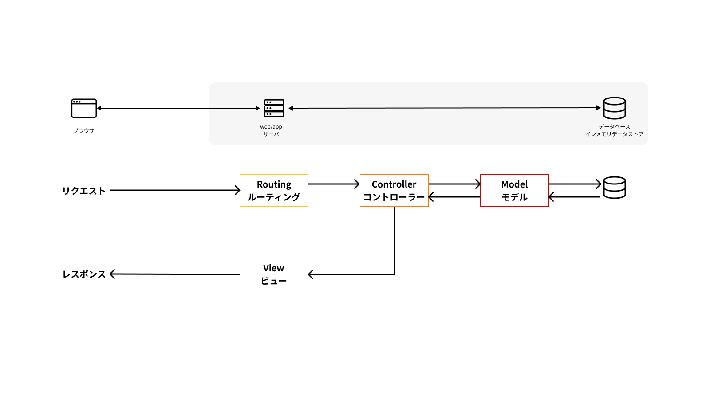
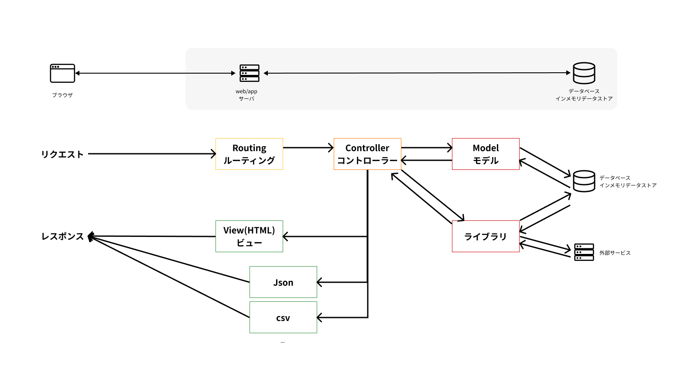

# MVCとルーティング


MVCとルーティングの関係図



## MVCとは

MVCモデルとは、プログラムを役割ごとにModel（モデル）・View（ビュー）・Controller（コントローラー）の3つに分けて管理するソフトウェア設計モデルのことです。
Model・View・Controllerの頭文字を取ってMVCモデルと呼ばれます。

### Model

Model(モデル)は、システムの中で扱うデータを管理する(ビジネスモデル)を担当します。

Webアプリケーションフレームワークは、一般的に **ORM(Object Relational Mapping)** という機能を使って、データベースのテーブルとモデルを紐付けています。
Railsでいえば、app/models/以下のファイルが該当し、ActiveRecordを継承したクラスがモデルとなります。

該当するファイル群: app/models/**

```ruby
Article.where(title: '記事タイトル')
Article.find_by(title: '記事タイトル')
```

### View

View(ビュー)は、ユーザーが見る画面を担当します。

今回使用するテンプレートエンジンは **ERB** というものです。他には、HamlやSlimなどがあります。

該当するファイル群: app/views/**

```ruby
<main>
  <div class="container px-2 py-3 my-3">
    <div class="d-flex justify-content-between align-items-center">
      <div><h2 class="fs-3 fw-bold"><%= title %></h2></div>
    </div>
  </div>
</main>
```

### Controller

Controller(コントローラー)は、ユーザーからのリクエストを受け取り、ModelとViewを制御します。

該当するファイル群: app/controllers/**

```ruby
# frozen_string_literal: true

class User::TopController < User::ApplicationController
  def index; end

  def about
    file = File.open Rails.root.join("app/assets/files/about.md")
    @markdown = ::MarkdownRenderer.md_to_html(file.read)
  end

  def terms; end

  def privacy
    file = File.open(Rails.root.join("app/assets/files/privacy.md"))
    @markdown = ::MarkdownRenderer.md_to_html(file.read)
  end
end

```

## ルーティングとは

Routing(ルーティング)は、ユーザーからのリクエストをControllerに振り分ける仕組みです。
基本的にはリクエストに応じて、どのControllerのどのActionを呼び出すかを定義します。

該当するファイル群:

config/routes/**

config/routes.rb

```ruby
# frozen_string_literal: true

Rails.application.routes.draw do
  get "/" => "user/top#index", as: :user_top
  get "/premium" => "user/top#premium", as: :premium
  get "/about" => "user/top#about", as: :about
  get "/terms" => "user/top#terms", as: :terms
  get "/privacy" => "user/top#privacy", as: :privacy
end
```

## MVCとルーティングの関係

MVCとルーティングの関係を図にすると以下のようになります。
MVCのみ説明されることが多いですが、ルーティングも含めて理解することが大切です。


