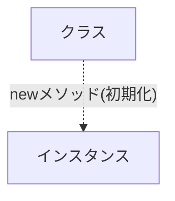

# クラス/メソッドの定義

## クラスとインスタンス



### Class

クラスは特定の関心事を持つメソッドや定数をまとめたものです。クラスはオブジェクトであり、インスタンスを作成することができます。

```ruby
# frozen_string_literal: true

class Janken
  # メソッド
  # 変数・定数
  # などを定義する
end
```

### Instance

インスタンスは、クラスから生成されたオブジェクトのことを指します。

```ruby
# frozen_string_literal: true

class Janken
  # newメソッドを使用してインスタンスを生成した場合に、initializeメソッドが呼び出される
  def initialize(inputed_hand = 0)
    @inputed_hand = inputed_hand
  end
end

a = Janken.new
```

### Module

Rubyのモジュールは、関連するメソッドや定数をグループ化するための仕組みです。クラスと同じように、モジュールもオブジェクトです。モジュールはインスタンスを作成することはできません。

- 定数やメソッドをまとめる
- クラスに組み込んで多重継承を実現する(ミックスイン)
- 名前空間を提供する

```ruby
# frozen_string_literal: true

module Training
  class Janken
  end
end
```

## メソッド

### メソッドの定義

Rubyでは、`def` というキーワードを使ってメソッドを定義します。

```ruby
def sample_method
  # 処理
end
```

### メソッドの呼び出し

```ruby
def sample_method
  puts "This is sample method."
end

# 1.
sample_method
#=> This is sample method.

# 2. この呼び方でもOK
sample_method()
#=> This is sample method.
```

### 引数

```ruby
# arg1, arg2 は引数
def sample_method(arg1, arg2)
  puts arg1
  puts arg2
end

sample_method("Hello", "World")
#=> Hello
#=> World
```

これでもOK

```ruby
# かっこを省略してもOK
def sample_method1 arg1, arg2
  puts arg1
  puts arg2
end

sample_method1("Hello", "World")
#=> Hello
#=> World

# 初期値を設定することもできる
def sample_method2 arg1="Hello", arg2="World"
  puts arg1
  puts arg2
end

sample_method2("Hello", "World")
#=> Hello
#=> World

# キーワードを指定して引数を渡すこともできる
def sample_method3 arg1: "Hello", arg2: "World"
  puts arg1
  puts arg2
end

# キーワードを指定する場合は、関数を呼び出すときもキーワードを指定する必要がある
sample_method3(arg1: "Hello", arg2: "World")
#=> Hello
#=> World
```

## クラスのメソッド

### インスタンスメソッド

クラスから生成されたインスタンスから呼び出すことができるメソッドです。

```ruby

class Janken
  def initialize(inputed_hand = 0)
    @inputed_hand = inputed_hand
  end

  def inputed_hand
    @inputed_hand
  end
end

# インスタンスを生成
janken = Janken.new(1)

# インスタンスメソッドを呼び出す
janken.inputed_hand
```

### クラスメソッド

クラスから直接呼び出すことができるメソッドです。

```ruby
class Janken
  def initialize(inputed_hand = 0)
    @inputed_hand = inputed_hand
  end

  def self.hands
    %w[グー チョキ パー]
  end
end

# クラスメソッドを呼び出す
Janken.hands
#=> ["グー", "チョキ", "パー"]
```
