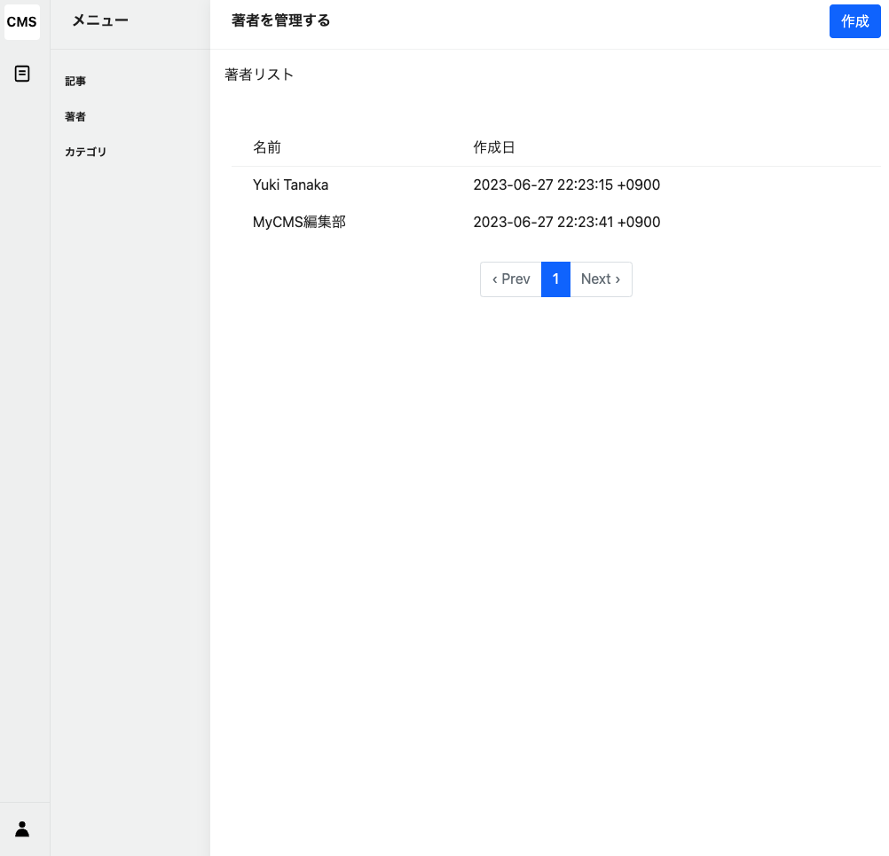
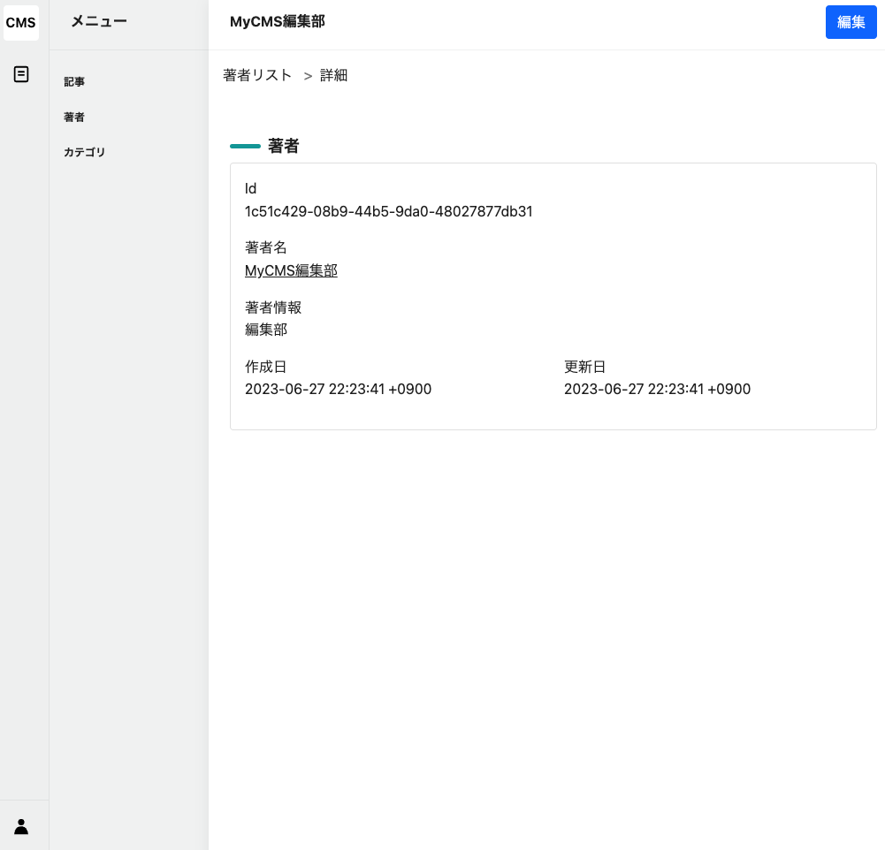
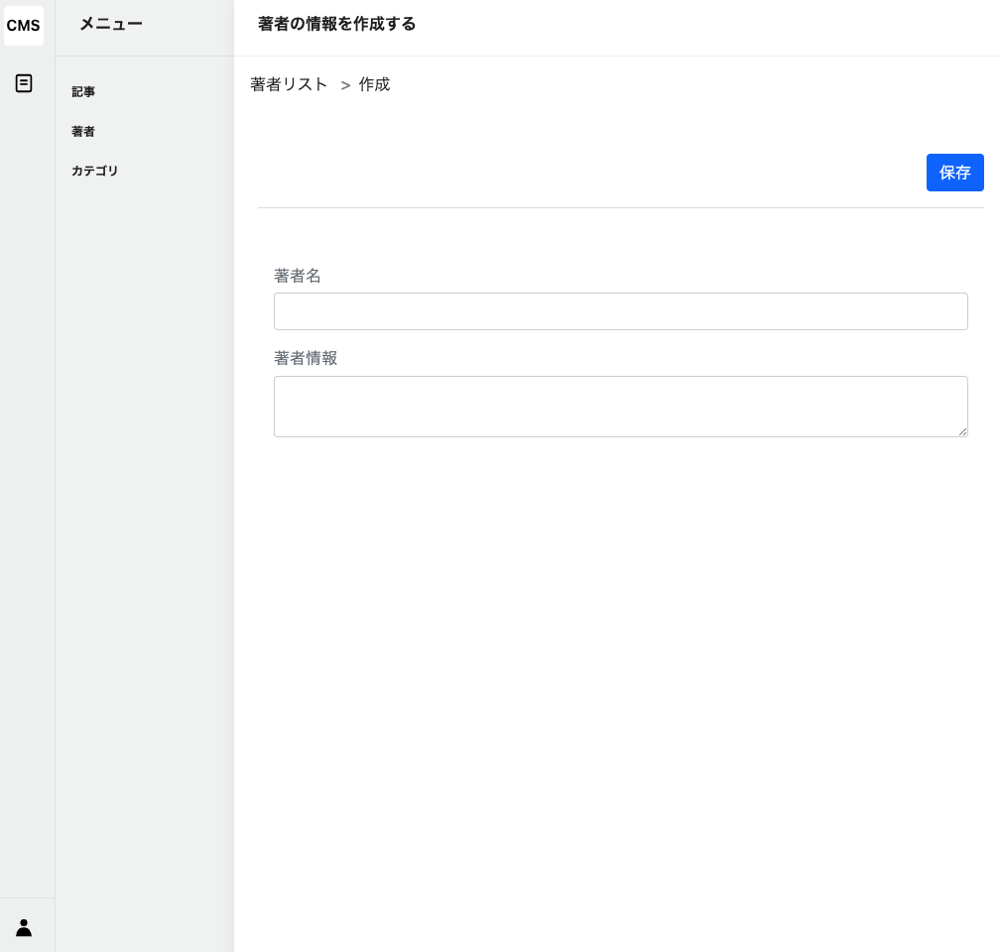
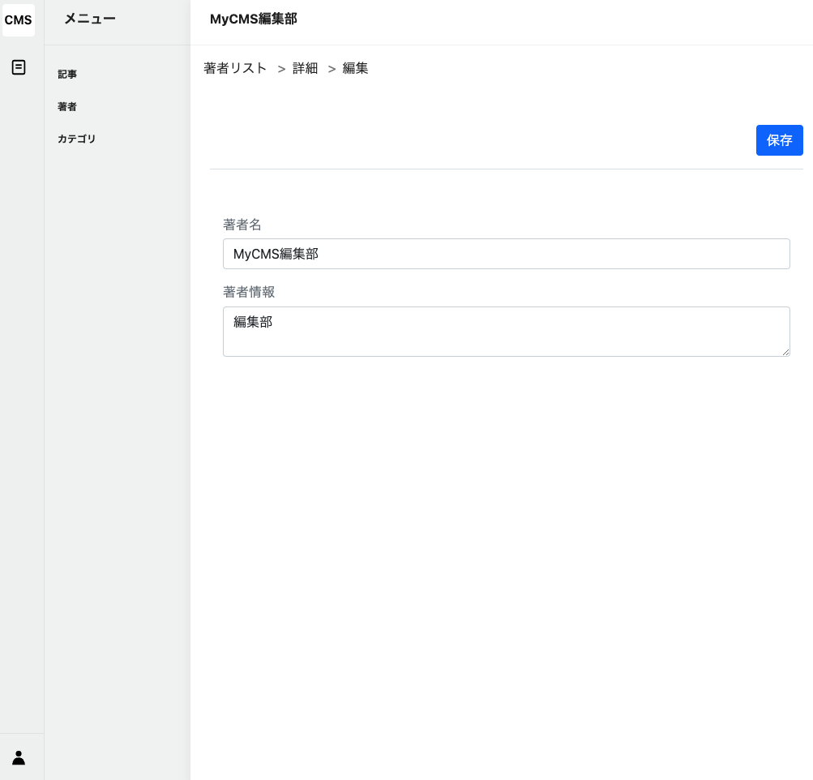

# 記事管理機能⓪：実装済みサンプル

## 実装済みサンプル

- 著者管理機能

- カテゴリ管理機能

## 著者管理機能

### できること

- 著者情報を一覧で閲覧することができる
- 著者詳細情報を閲覧することができる
- 著者情報を新規登録することができる
- 著者情報を編集することができる

### 一覧画面

|  File                      | Path                     |
|-------------------------------|----------------------------|
| Route   | `config/routes/admin/authors.rb` |
| Controller   | `app/controllers/admin/authors_controller.rb#index` |
| View   | `app/views/admin/authors/index.html.erb` |
| Model  | `app/models/article.rb` |
| Url  | `http://localhost:3000/admin/authors` |



### 詳細画面

|  File                      | Path                     |
|-------------------------------|----------------------------|
| Route   | `config/routes/admin/authors.rb` |
| Controller   | `app/controllers/admin/authors_controller.rb#show` |
| View   | `app/views/admin/authors/show.html.erb` |
| Model  | `app/models/article.rb` |
| Url  | `http://localhost:3000/admin/authors/:id` |



### 新規登録画面

|  File                      | Path                     |
|-------------------------------|----------------------------|
| Route   | `config/routes/admin/authors.rb` |
| Controller(画面表示用)   | `app/controllers/admin/authors_controller.rb#new` |
| Controller(データ作成用)   | `app/controllers/admin/authors_controller.rb#create` |
| View   | `app/views/admin/authors/new.html.erb` |
| Model  | `app/models/article.rb` |
| Url  | `http://localhost:3000/admin/authors/new` |



### 編集画面

|  File                      | Path                     |
|-------------------------------|----------------------------|
| Route   | `config/routes/admin/authors.rb` |
| Controller(画面表示用)   | `app/controllers/admin/authors_controller.rb#edit` |
| Controller(データ更新用)   | `app/controllers/admin/authors_controller.rb#update` |
| View   | `app/views/admin/authors/edit.html.erb` |
| Model  | `app/models/article.rb` |
| Url  | `http://localhost:3000/admin/authors/:id/edit` |



### 実際のソースコード（Controller）

キーワード
> ActiveRecord, Strong Parameters

※本プロジェクトでは、Ransack, Pagyというgemを使用しています。

Ransak: 検索機能, Pagy: ページネーション機能

```ruby
# frozen_string_literal: true

class Admin::AuthorsController < Admin::ApplicationController
  def index
    @q = Author.ransack(params[:q])
    @pagy, @authors = pagy(@q.result(distinct: true))
  end

  def show
    @author = Author.find(params[:id])
  end

  def new
    @author = Author.new
  end

  def create
    @author = Author.new(create_params)
    if @author.save
      flash.now.notice = t("admin.create.success")
      redirect_to admin_authors_path
    else
      flash.now.alert = t("admin.create.failed")
      render :new, status: :unprocessable_entity
    end
  end

  def edit
    @author = Author.find(params[:id])
  end

  def update
    @author = Author.find(params[:id])
    if @author.update(update_params)
      flash.now.notice = t("admin.update.success")
      redirect_to admin_author_path
    else
      flash.now.alert = t("admin.update.failed")
      render :edit, status: :unprocessable_entity
    end
  end

  private

  def create_params
    params.require(:author).permit(
      :name,
      :bio
    )
  end

  def update_params
    create_params
  end
end
```

#### ActiveRecord

ActiveRecordとは、RailsのORM(Object Relational Mapping)のことです。データベースのテーブルと、Rubyのオブジェクトをマッピングすることで、データベースの操作をRubyのコードで行うことができます。

例えば、`show`アクションのコードを見てみましょう。

```ruby
def show
  @author = Author.find(params[:id])

  # `http://localhost:3000/admin/authors/1`というURLにアクセスした場合、
  # `params[:id]`は`1`という値になります。
  # そのため、`Author.find(params[:id])`というコードは、
  # `authors`テーブルから`id`が`1`のレコードを取得するという意味になります。
  # つまり、Article.find("1")となります。
end
```

- `Author.find(params[:id])`というコードがありますが、これは、`authors`テーブルから`id`が`params[:id]`のレコードを取得するという意味です。

- `find`メソッドは、`ActiveRecord::Base`クラスのメソッドです。`Author`モデルは、`ActiveRecord::Base`クラスを継承しているので、`find`メソッドを使用することができます。`find`メソッドは、指定された`id`のレコードを取得することができます。

- params[:id]は、URLのパスに含まれる`:id`という名前のパラメータの値を取得することができます。例えば、`http://localhost:3000/admin/authors/1`というURLの場合、`:id`の値は`1`になります。

**save, updateメソッド**

saveメソッドは、レコードを保存するメソッドです。`create`メソッドや`update`メソッドを実行すると、内部で`save`メソッドが実行されます。

```ruby
def create
  @author = Author.new(create_params)
  # 以下の部分
  if @author.save
    flash.now.notice = t("admin.create.success")
    redirect_to admin_authors_path
  else
    flash.now.alert = t("admin.create.failed")
    render :new, status: :unprocessable_entity
  end
end
```

レコード保存関連のメソッドまとめ

戻り値が重要です。true/falseで判定したい場合は、saveメソッドを使用する。失敗した時に例外を投げたい場合は、ビックリマークが使用されているsave!やupdate!メソッドを使用します。

| メソッド名 | 使用例 | 戻り値 | 備考 |
|---|---|---|---|
| save | `user.save` | 成功時は`true`、失敗時は`false` | レコードを保存します。バリデーションに失敗した場合でも例外を投げません。 |
| save! | `user.save!` | 成功時は`true` | レコードを保存します。バリデーションに失敗すると例外(ActiveRecord::RecordInvalid)を投げます。 |
| create | `User.create(name: 'Alice')` | 新規作成したオブジェクト | 新規レコードを生成し、成功時に保存します。バリデーションに失敗した場合でも例外を投げません。 |
| create! | `User.create!(name: 'Alice')` | 新規作成したオブジェクト | 新規レコードを生成し、保存します。バリデーションに失敗すると例外(ActiveRecord::RecordInvalid)を投げます。 |
| update | `user.update(name: 'Bob')` | 成功時は`true`、失敗時は`false` | レコードを更新します。バリデーションに失敗した場合でも例外を投げません。 |
| update! | `user.update!(name: 'Bob')` | 成功時は`true` | レコードを更新します。バリデーションに失敗すると例外(ActiveRecord::RecordInvalid)を投げます。 |


#### Strong Parameters

```ruby
private

def create_params
  params.require(:author).permit(
    :name,
    :bio
  )
end
```

- Strong Parametersとは、Railsで提供されている機能で、フォームから送信されたデータを安全に取得することができます。

- `Parameters: {"authenticity_token"=>"[FILTERED]", "author"=>{"name"=>"Yuki Tanaka", "bio"=>"Yuki Tanaka2"}, "id"=>"326b474f-908b-490d-8d61-9b8d024a677f"}`というようなデータがあるとします。このデータは、`params`というメソッドで取得することができます。

- `params`メソッドは、`ActionController::Parameters`クラスのインスタンスを返します。このクラスは、`Hash`クラスを継承しているので、`Hash`クラスのメソッドを使用することができます。

- `params`メソッドで取得したデータは、`require`メソッドで指定したキーの値を取得することができます。例えば、`params.require(:author)`とすると、`params`メソッドで取得したデータの`:author`というキーの値を取得することができます。

- `permit`メソッドは、`require`メソッドで取得したデータのうち、指定したキーの値を取得することができます。例えば、`params.require(:author).permit(:name, :bio)`とすると、`params`メソッドで取得したデータの`:author`というキーの値のうち、`:name`と`:bio`というキーの値のみ取得することができます。

- ブラウザなどから予期しないデータが送信されたとしても、`permit`メソッドで指定したキーの値のみ取得することができるので、安全にデータを取得することができます。

## カテゴリ管理機能

上記の著者管理機能と同様の機能を持つので省略します。基本的なCRUD機能はほとんど同じです。
削除機能はスキップしているので、興味のある方は実装してみてください。
