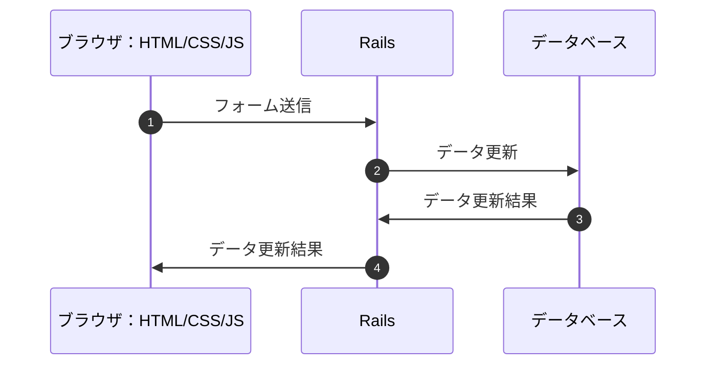
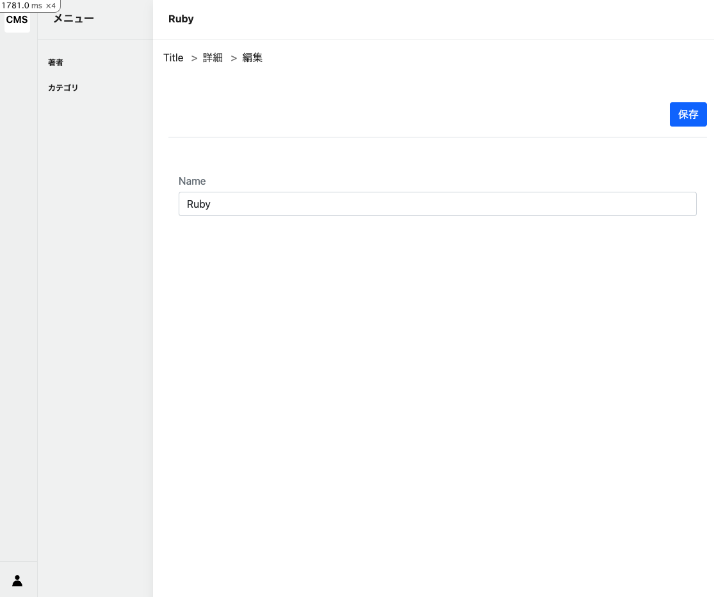
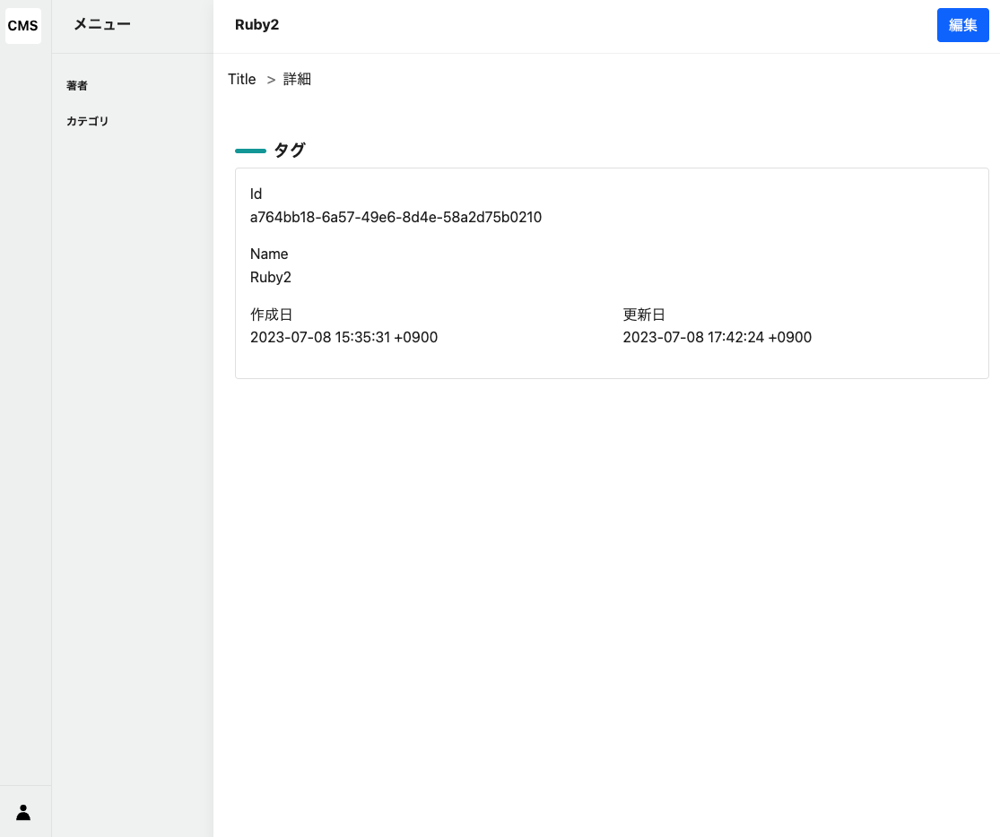

# Tag編集画面

## 編集画面の概要

編集画面は、2つのアクションで構成されています。

- `edit`アクション：編集画面を表示するアクション
- `update`アクション：編集画面から送信されたデータを受け取り、データを更新するアクション

### フォーム送信の流れ



## editアクション

### コントローラーのアクション作成

[code]

`edit`アクションは、編集画面を表示するアクションです。

`@tag`には、`params[:id]`で取得したIDを使用して、`Tag`モデルからデータを取得しています。

```ruby
# frozen_string_literal: true

class Admin::TagsController < Admin::ApplicationController
  # 省略

  def edit
    @tag = Tag.find(params[:id])
  end
end
```

### パンくずリストの作成

[command]

```bash
touch app/views/admin/tags/breadcrumb/_edit.html.erb
```

[code]

Filename: app/views/admin/tags/breadcrumb/_edit.html.erb

```erb
<li>
  <%= link_to edit_admin_tag_path do %>
    <%= t "breadcrumb.edit" %>
  <% end %>
</li>
```

### ビューの作成

[command]

以下2つのファイルを作成します。

- edit.html.erb
- _form_attributes.html.erb

```bash
touch app/views/admin/tags/edit.html.erb && touch app/views/admin/tags/_form_attributes.html.erb
```

`edit.html.erb`は、編集画面のHTMLを記述するファイルです。

`_form_attributes.html.erb`は、フォームのHTMLを記述するファイルです。作成画面でも使用するため、予めコンポーネント化しています。
コンポーネントファイルの特徴は、ファイル名の先頭に`_`が付くことです。

[code]

Filename: app/views/admin/tags/_form_attributes.html.erb

```erb
<%= form_with model: [:admin, @tag], local: true do |f| %>
  <div class="section">
    <div class="d-flex justify-content-between border-bottom pb-3">
      <div></div>
      <div class="d-flex">
        <div>
          <button class="btn btn-primary"><%= t "buttons.save" %></button>
        </div>
      </div>
    </div>
  </div>
  <div class="section">
    <div class="card border-0">
      <div class="card-body">
        <div class="row">
          <div class="col-md-12 mt-3">
            <%= f.label :name, class: "mb-1 form-label text-small text-muted" do %>
              <%= t "activerecord.attributes.tag.name" %>
            <% end %>
            <%= f.text_field :name, autofocus: true, class: "form-control", placeholder: "" %>
          </div>
        </div>
      </div>
    </div>
  </div>
<% end %>
```

Filename: app/views/admin/tags/edit.html.erb

```erb
<div class="l-container">
  <%= render partial: "layouts/admin/article_menu" %>
  <div class="l-main-view">
    <div class="sw-main-header">
      <div class="sw-main-header-title">
        <%= @tag&.name %>
      </div>
    </div>
    <div class="sw-main-body">
      <ul class="breadcrumb p-3">
        <%= render :partial => "admin/tags/breadcrumb/index" %>
        <%= render :partial => "admin/tags/breadcrumb/show" %>
        <%= render :partial => "admin/tags/breadcrumb/edit" %>
      </ul>
      <div class="section">
        <%= render :partial => "admin/flash" %>
      </div>
      <%= render :partial => "admin/tags/form_attributes" %>
    </div>
  </div>
</div>
```

### 編集画面の確認

[output]



編集画面が表示されました。次に、`update`アクションを作成します。

## updateアクション

### コントローラーのアクション作成

[code]

`update`アクションは、編集画面から送信されたデータを受け取り、データを更新するアクションです。

`@tag`には、`params[:id]`で取得したIDを使用して、`Tag`モデルからデータを取得しています。

Filename: app/controllers/admin/tags_controller.rb

```ruby
# frozen_string_literal: true

class Admin::TagsController < Admin::ApplicationController
  # 省略

  def edit
    @tag = Tag.find(params[:id])
  end

  def update
    @tag = Tag.find(params[:id])
    if @tag.update(update_params)
      flash.now.notice = t("admin.update.success")
      redirect_to admin_tag_path
    else
      flash.now.alert = t("admin.update.failed")
      render :edit, status: :unprocessable_entity
    end
  end

  private

  def create_params
    params.require(:tag).permit(
      :name
    )
  end

  def update_params
    create_params
  end
end
```

### 動作確認

`Ruby`という文字列を、`Ruby2`に変更して「保存」ボタンを押下します。

[output]

以下のように、`Ruby2`に変更されていることが確認できます。



### Updateアクションの深掘り

#### Strong Parameters

> [Strong Parameters](../appendix/controller.html#strong-parameters.md)については、別途解説しています

Strong Parametersとは、Railsで提供されている機能で、フォームから送信されたデータを安全に取得することができる機能です。

[code]

Updateアクションでは、`update_params`メソッドを使用して、フォームから送信されたデータを取得しています。

Filename: app/controllers/admin/tags_controller.rb

```ruby
# 省略

def create_params
  params.require(:tag).permit(
    :name
  )
end

def update_params
  create_params
end
```

[log]

`bin/rails`コマンドを実行しているターミナルに、以下のようなログが出力されます。開発中はログを見ながら開発することが多いので、ぜひログを確認する習慣をつけてみてください。
ログを見る習慣は障害対応の際にも役立ちます。

```bash
Started PATCH "/admin/tags/a764bb18-6a57-49e6-8d4e-58a2d75b0210" for 127.0.0.1 at 2023-07-08 17:42:24 +0900
Processing by Admin::TagsController#update as TURBO_STREAM
  Parameters: {"authenticity_token"=>"[FILTERED]", "tag"=>{"name"=>"Ruby2"}, "id"=>"a764bb18-6a57-49e6-8d4e-58a2d75b0210"}
```

`params`の中身は、Railsのログから確認することができます。以下の`parameters`が、`params`に当たります。

```console
Parameters: {"authenticity_token"=>"[FILTERED]", "tag"=>{"name"=>"Ruby2"}, "id"=>"a764bb18-6a57-49e6-8d4e-58a2d75b0210"}
```

`create_params`メソッドでは、`params`の中の`tag`を取得して、name属性のみ許可(permit)しています。


#### updateメソッド

> [Updateメソッド](./appendix/active-record.md)については、こちらで補足しています。

[code]

Updateアクションは、該当するTagのデータを取得しデータの更新行う際に、以下のような処理を行っています。

- データの更新が成功したら、`flash.now.notice`に成功メッセージを設定し、`admin_tag_path`にリダイレクトする
- データの更新が失敗したら、`flash.now.alert`に失敗メッセージを設定し、`edit`アクションをレンダリングする

Filename: app/controllers/admin/tags_controller.rb

```ruby
# 省略

def update
  @tag = Tag.find(params[:id])
  if @tag.update(update_params)
    flash.now.notice = t("admin.update.success")
    redirect_to admin_tag_path
  else
    flash.now.alert = t("admin.update.failed")
    render :edit, status: :unprocessable_entity
  end
end
```

最終的に`@tag.update(update_params)`は、以下のように更新されます。

```ruby
@tag.update({name: "Ruby2"})
```

最後に、新規作成画面の作成を行います。
