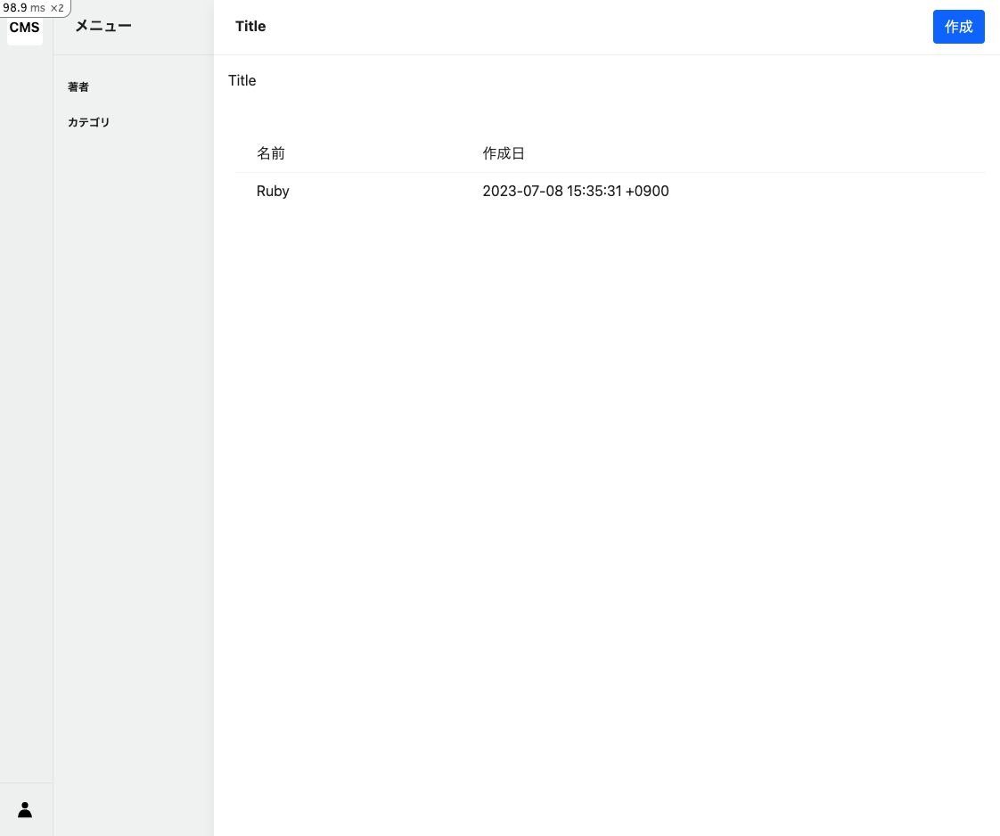

# Tag一覧画面

## 一覧画面の改善

[記事管理機能①：タグ管理](./cms-tag.md)で作成した一覧画面を、より使いやすく改善します。

[command]

以下のコマンドで、一覧画面を改善します。

- `app/views/admin/tags/breadcrumb`フォルダと`_index.html.erb`ファイルを作成します。
- `app/views/admin/tags/_index_table.html.erb`ファイルを作成します。

```bash
mkdir -p app/views/admin/tags/breadcrumb && touch app/views/admin/tags/breadcrumb/_index.html.erb && touch app/views/admin/tags/_index_table.html.erb
```

## indexアクションの更新

[code]

先ほど作成したindexアクションを以下のように更新します。Tagモデルを使用して、全てのTagデータを取得します。

モデルの全てのデータを取得したい時は、`モデル名.all`と記述します。

Filename: app/controllers/admin/tags_controller.rb

```ruby
# frozen_string_literal: true

class Admin::TagsController < Admin::ApplicationController
  def index
    @tags = Tag.all
  end
end
```

## パンくずリストの作成

[code]

パンくずリストは、画面の上部に表示されるリストです。パンくずリストを作成することで、どの画面にいるのかをユーザーに伝えることができます。

`admin_tags_path`は、`/admin/tags`のパスを返します。ルーティングの設定を行ったので、ヘルパーメソッドを使用することでパスを取得できます。

Filename: app/views/admin/tags/breadcrumb/_index.html.erb

```erb
<li>
  <%= link_to admin_tags_path do %>
    <%= t ".title" %>
  <% end %>
</li>
```

もしヘルパーメソッドを使わない書き方をしたい場合は、以下のように記述します。

### 例1

```erb
<li>
  <%= link_to "/admin/tags" do %>
    <%= t ".title" %>
  <% end %>
</li>
```

### 例2

```erb
<li>
  <a href="/admin/tags"><%= t ".title" %></a>
</li>
```

## 一覧表示のテーブルの作成

[code]

Filename: app/views/admin/tags/_index_table.html.erb

```erb
<div class="sw-main-body-table table-responsive">
  <table>
    <thead>
      <tr>
        <th></th>
        <th>名前</th>
        <th>作成日</th>
      </tr>
    </thead>
    <tbody>
      <% @tags.each do |tag| %>
        <tr>
          <td class="rowlink">
            <%= link_to admin_tag_path(id: tag&.id) do %>
            <% end %>
          </td>
          <td style="min-width: 100px;">
            <%= tag&.name %>
          </td>
          <td style="min-width: 150px;">
            <%= tag&.created_at %>
          </td>
        </tr>
      <% end %>
    </tbody>
  </table>
</div>
```

### eachメソッド

`each`メソッドは、配列やハッシュの要素を順番に取り出すことができます。

### &.演算子

`&.演算子`は、`nil`の場合にエラーを発生させないようにするための演算子です。


## Tagデータの作成

一覧画面に、Tagデータを表示したいですが、まだデータが存在しないため、表示することができません。

Railsコンソールを使用して、Tagデータを作成します。

[command]

```bash
bin/rails c
```

[code]

Railsコンソール内で、以下のコードを実行します。

```ruby
Tag.create(name: "Ruby")
```

[output]

Tagモデルを使用して、Tagデータを作成します。

```ruby
/workspace# bin/rails c
Loading development environment (Rails 7.0.3)
[1] pry(main)> Tag.create(name: "Ruby")
  TRANSACTION (0.1ms)  BEGIN
  Tag Create (0.9ms)  INSERT INTO "tags" ("name", "created_at", "updated_at") VALUES ($1, $2, $3) RETURNING "id"  [["name", "Ruby"], ["created_at", "2023-07-08 15:35:31.415910"], ["updated_at", "2023-07-08 15:35:31.415910"]]
  TRANSACTION (0.9ms)  COMMIT
=> #<Tag:0x0000ffff852366a0
 id: "a764bb18-6a57-49e6-8d4e-58a2d75b0210",
 name: "Ruby",
 created_at: Sat, 08 Jul 2023 15:35:31.415910000 JST +09:00,
 updated_at: Sat, 08 Jul 2023 15:35:31.415910000 JST +09:00>
```

上記の結果から、`id: "a764bb18-6a57-49e6-8d4e-58a2d75b0210", name: "Ruby"`のTagデータが作成されたことがわかります。

## 一覧画面用のテーブルを表示する

[code]

Filename: app/views/admin/tags/index.html.erb

```erb
<div class="l-container">
  <%= render partial: "layouts/admin/article_menu" %>
  <div class="l-main-view">
    <div class="sw-main-header">
      <div class="sw-main-header-title">
        <%= t ".title" %>
      </div>
      <div class="sw-main-header-buttons">
        <div class="sw-main-header-button">
          <%= link_to new_admin_tag_path, class: "btn btn-primary" do %>
            <%= t "buttons.create" %>
          <% end %>
        </div>
      </div>
    </div>
    <div class="sw-main-body">
      <ul class="breadcrumb p-3">
        <%= render partial: "admin/tags/breadcrumb/index" %>
      </ul>
      <%= render partial: "admin/tags/index_table" %>
    </div>
  </div>
</div>
```

## 一覧画面の確認

[output]

ブラウザで以下のURLにアクセスすると、以下のような画面が表示されます。



※ 注意点
- RubyのTagデータが表示されていることを確認してください
- Rubyをクリックしても、詳細画面に遷移しないことを確認してください。
  - なぜなら、詳細画面の作成を行っていないため、詳細画面に遷移することができないからです。

次に、詳細画面の作成を行います。