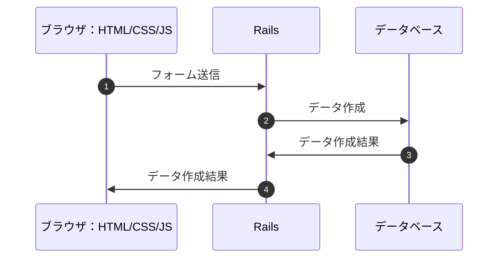
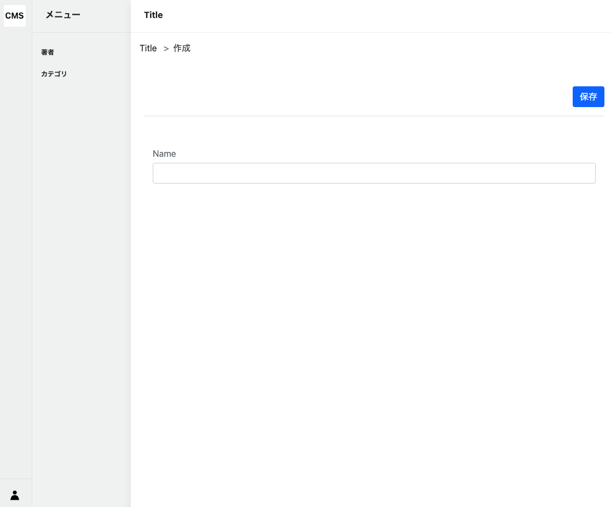
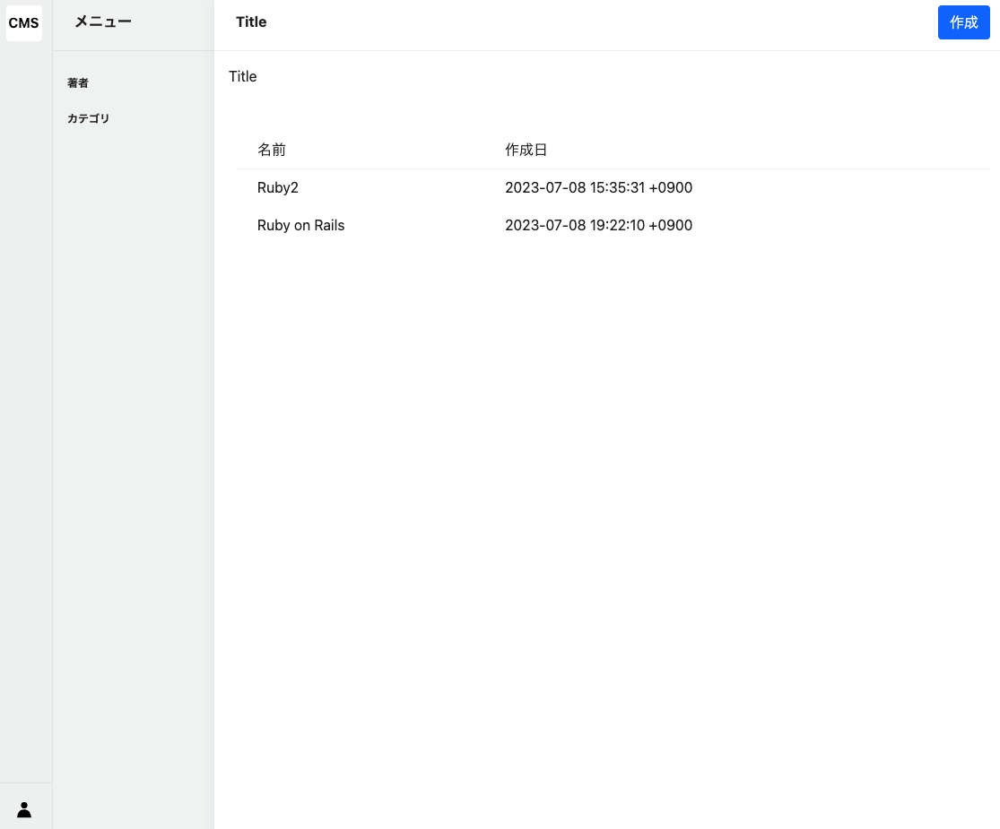

# Tag作成画面

## 作成画面の概要

作成画面は、2つのアクションで構成されています。

- `new`アクション：作成画面を表示するアクション
- `create`アクション：作成画面から送信されたデータを受け取り、データを更新するアクション

### フォーム送信の流れ



## newアクション

### コントローラーのアクション作成

[code]

`new`アクションは、作成画面を表示するアクションです。

`Tag.new`で、`Tag`モデルのインスタンスを作成しています。

```ruby
# frozen_string_literal: true

class Admin::TagsController < Admin::ApplicationController
  # 省略

  def new
    @tag = Tag.new
  end
end
```

### パンくずリストの作成

[command]

```bash
touch app/views/admin/tags/breadcrumb/_new.html.erb
```

[code]

Filename: app/views/admin/tags/breadcrumb/_new.html.erb

```erb
<li>
  <%= link_to new_admin_tag_path do %>
    <%= t "breadcrumb.new" %>
  <% end %>
</li>
```

### ビューの作成

[command]

```bash
touch app/views/admin/tags/new.html.erb
```

[code]

編集画面と同様のレイアウトを使用します。

Filename: app/views/admin/tags/new.html.erb

```erb
<div class="l-container">
  <%= render partial: "layouts/admin/article_menu" %>
  <div class="l-main-view">
    <div class="sw-main-header">
      <div class="sw-main-header-title">
        <%= t ".title" %>
      </div>
    </div>
    <div class="sw-main-body">
      <ul class="breadcrumb p-3">
        <%= render partial: "admin/tags/breadcrumb/index" %>
        <%= render partial: "admin/tags/breadcrumb/new" %>
      </ul>
      <div class="section">
        <%= render :partial => "admin/flash" %>
      </div>
      <%= render :partial => "admin/tags/form_attributes" %>
    </div>
  </div>
</div>
```

### 作成画面の確認



作成画面が表示されました。次に、`create`アクションを作成します。

## createアクション

### コントローラーのアクション作成

[code]

Tagモデルのインスタンスを作成し、`save`メソッドでデータを保存します。

Filename: app/controllers/admin/tags_controller.rb

```ruby
# frozen_string_literal: true

class Admin::TagsController < Admin::ApplicationController
  # 省略

  def create
    @tag = Tag.new(create_params)
    if @tag.save
      flash.now.notice = t("admin.create.success")
      redirect_to admin_tags_path
    else
      flash.now.alert = t("admin.create.failed")
      render :new, status: :unprocessable_entity
    end
  end

  private

  # 編集画面で作成したStrong Parametersを使用する
  def create_params
    params.require(:tag).permit(
      :name
    )
  end
end
```

基本的には、`update`アクションと同様の処理です。

Createアクションは、Tagモデルのインスタンスを作成し、`save`メソッドでデータを保存します。

- データの更新が成功したら、`flash.now.notice`に成功メッセージを設定し、`admin_tags_path`にリダイレクトする
- データの更新が失敗したら、`flash.now.alert`に失敗メッセージを設定し、`new`アクションをレンダリングする

`Ruby on Rails`という文字列を入力して、保存ボタンを押下します。以下のようにTag一覧画面に`Ruby on Rails`が追加されたら成功です。


