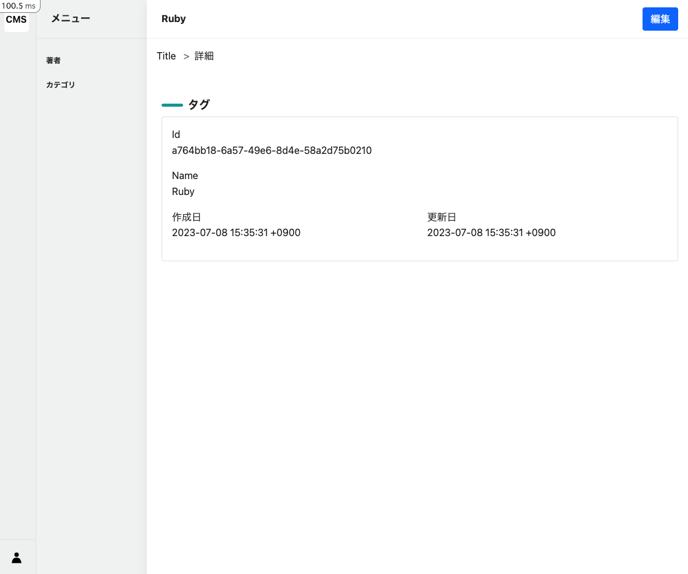

# Tag詳細画面

## showアクション

[code]

Tagモデルのidを元に、データを取得します。params[:id]は、ルーティングで設定した:idに対応しています。

```ruby
# frozen_string_literal: true

class Admin::TagsController < Admin::ApplicationController
  # 省略

  def show
    @tag = Tag.find(params[:id])
  end
end
```

`/admin/tags/a764bb18-6a57-49e6-8d4e-58a2d75b0210`のようなURLでアクセスされた場合、`params[:id]`には`a764bb18-6a57-49e6-8d4e-58a2d75b0210`が入ります。
つまり、`Tag.find("a764bb18-6a57-49e6-8d4e-58a2d75b0210")`と同じ意味になります。

```ruby
@tag = Tag.find(params[:id])
# ↓
@tag = Tag.find("a764bb18-6a57-49e6-8d4e-58a2d75b0210")
# ↓
# ActiveRecord形式で取得できる
<Tag:0x0000ffff9c9bbe40
 id: "a764bb18-6a57-49e6-8d4e-58a2d75b0210",
 name: "Ruby",
 created_at: Sat, 08 Jul 2023 15:35:31.415910000 JST +09:00,
 updated_at: Sat, 08 Jul 2023 15:35:31.415910000 JST +09:00>
```

## パンくずリストの作成

[command]

```bash
touch app/views/admin/tags/breadcrumb/_show.html.erb
```

[code]

```erb
<li>
  <%= link_to admin_tag_path do %>
    <%= t "breadcrumb.show" %>
  <% end %>
</li>
```

## 詳細画面の作成

[code]

```erb
<div class="l-container">
  <%= render partial: "layouts/admin/article_menu" %>
  <div class="l-main-view">
    <div class="sw-main-header">
      <div class="sw-main-header-title">
        <%= @tag&.name %>
      </div>
      <div class="sw-main-header-buttons">
        <div class="sw-main-header-button">
          <%= link_to edit_admin_tag_path, class: "btn btn-primary" do %>
            <%= t "buttons.edit" %>
          <% end %>
        </div>
      </div>
    </div>
    <div class="sw-main-body">
      <ul class="breadcrumb p-3">
        <%= render partial: "admin/tags/breadcrumb/index" %>
        <%= render partial: "admin/tags/breadcrumb/show" %>
      </ul>
      <div class="section">
        <%= render :partial => "admin/flash" %>
      </div>
      <div class="section">
        <h2 class="admin-title">タグ</h2>
        <div class="card">
          <div class="card-body">
            <div class="row">
              <div class="col-md-6 mb-3">
                <div class="model-key">
                  <%= t "activerecord.attributes.tag.id" %>
                </div>
                <div class="model-value">
                  <%= @tag&.id %>
                </div>
              </div>
            </div>
            <div class="row">
              <div class="col-md-6 mb-3">
                <div class="model-key">
                  <%= t "activerecord.attributes.tag.name" %>
                </div>
                <div class="model-value">
                  <%= @tag&.name %>
                </div>
              </div>
            </div>
            <div class="row">
              <div class="col-md-6 mb-3">
                <div class="model-key">
                  <%= t "common.created_at" %>
                </div>
                <div class="model-value">
                  <%= @tag&.created_at %>
                </div>
              </div>
              <div class="col-md-6 mb-3">
                <div class="model-key">
                  <%= t "common.updated_at" %>
                </div>
                <div class="model-value">
                  <%= @tag&.updated_at %>
                </div>
              </div>
            </div>
          </div>
        </div>
      </div>
    </div>
  </div>
</div>
```

### 詳細画面の確認

[output]



※ 注意点
- RubyのTagデータが表示されていることを確認してください
- 編集画面に遷移しないことを確認してください。
  - なぜなら、編集画面の作成を行っていないため、編集画面に遷移することができないからです。

次は、Tagの編集画面を作成します。
