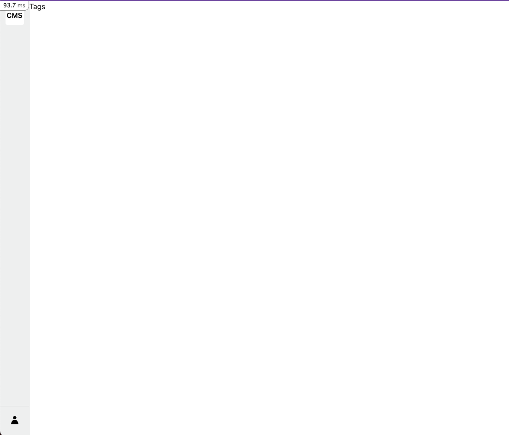

# 記事管理機能①：タグ管理

Author, Categoryを参考に、タグ管理機能を実装してみましょう。

## 要件

- タグを管理することができる。
- タグは、タグ名のデータを持つ。

## やること

- マイグレーション
- モデル作成
- コントローラ作成
- ルーティングの設定
- ビュー作成
  - 一覧画面
  - 詳細画面
  - 新規作成画面
  - 編集画面

今回はコマンドラインからの作成をしつつ、手動で作成する方法も紹介します。
## マイグレーション

タグを管理するためのテーブルを作成するマイグレーションを作成します。

[command]

```bash
bin/rails g migration CreateTags
```

[code]

タグ名用のカラムを追加したいので、以下のようにマイグレーションファイルを編集します。

Filename: db/migrate/20230708053757_create_tags.rb

```ruby
# frozen_string_literal: true

class CreateTags < ActiveRecord::Migration[7.0]
  def change
    create_table :tags, id: :uuid do |t|
      t.string :name, null: false, comment: "タグ名"
      t.timestamps
    end
  end
end
```

[command]

以下コマンドを実行すると、データベースにTagテーブルが作成されます。

```bash
bin/rails db:migrate
```

[output]

```console
== 20230708053757 CreateTags: migrating =======================================
-- create_table(:tags, {:id=>:uuid})
   -> 0.0091s
== 20230708053757 CreateTags: migrated (0.0092s) ==============================
```

[command]

Tagテーブルの状態を確認するには、以下コマンドを実行します。

```bash
bin/rails db:migrate:status
```

[output]

Create Tags がupになっていることが確認できます。

```console
 Status   Migration ID    Migration Name
--------------------------------------------------
   ...
   up     20230708053757  Create tags
```


## モデル作成

タグを管理するためのモデルを作成します。

[command]

```bash
touch app/models/tag.rb
```

[code]

Filename: app/models/tag.rb

以下ファイルにモデルの定義を記述します。

基本的にActiveRecordを継承したクラスを作成します。

```ruby
# frozen_string_literal: true

class Tag < ApplicationRecord
end
```

## コントローラ作成

タグを管理するためのコントローラを作成します。

[command]

```bash
touch app/controllers/admin/tags_controller.rb
```

[code]

Filename: app/controllers/admin/tags_controller.rb

```ruby
# frozen_string_literal: true

class Admin::TagsController < Admin::ApplicationController
end
```

## ルーティングの設定

画面表示やデータの作成、更新、削除を行うためのルーティングを設定します。

以下のコマンドでTag用のルーティングファイルを作成します。

[command]

```bash
touch config/routes/admin/tags.rb
```

以下のようにルーティングを設定します。

[code]

Filename: config/routes/admin/tags.rb

```ruby
# frozen_string_literal: true

Rails.application.routes.draw do
  namespace :admin do
    resources :tags
  end
end
```

詳しいルーティングの詳細については、[ルーティングについて](../appendix/routing.md)を参照してください。
### ルーティングをコマンドで確認する

Railsには、設定したルーティングを確認するコマンドが用意されています。

`bin/rails routes` コマンドを実行すると、設定したルーティングを確認することができます。

[command]

```bash
bin/rails routes -g tag
```

[output]

```console
        Prefix Verb   URI Pattern                    Controller#Action
    admin_tags GET    /admin/tags(.:format)          admin/tags#index
               POST   /admin/tags(.:format)          admin/tags#create
 new_admin_tag GET    /admin/tags/new(.:format)      admin/tags#new
edit_admin_tag GET    /admin/tags/:id/edit(.:format) admin/tags#edit
     admin_tag GET    /admin/tags/:id(.:format)      admin/tags#show
               PATCH  /admin/tags/:id(.:format)      admin/tags#update
               PUT    /admin/tags/:id(.:format)      admin/tags#update
               DELETE /admin/tags/:id(.:format)      admin/tags#destroy
```

上記のように表示されていれば、ルーティングの設定は正しく行われています。

## ビュー作成

画面表示を行うために、ビューを作成します。まずは一覧画面から作成していきます。
### 一覧画面

以下のコマンドで、一覧画面用のビューを作成します。

#### ビューフォルダとファイル作成

[command]

```bash
mkdir -p app/views/admin/tags && touch app/views/admin/tags/index.html.erb
```

#### コントローラーのアクション作成

[code]

ビューに対応するコントローラーのアクションを作成します。今回は、Tag一覧画面を作成するので、indexアクションを追加します。

Filename: app/controllers/admin/tags_controller.rb

```ruby
# frozen_string_literal: true

class Admin::TagsController < Admin::ApplicationController
  def index; end
end
```

#### ビューの作成

[code]

Filename: app/views/admin/tags/index.html.erb

```erb
Tags
```

#### ルーティングの更新

[command]

ルーティングを更新する際は、一度サーバーを停止してから再起動する必要があります。

`bin/rails s`でサーバーを起動している場合は、以下のように`Ctrl + C`でサーバーを停止してください。

```bash
Ctrl + C
```

再度サーバーを起動します。

```bash
bin/rails s
```

#### ブラウザで確認

[output]

ブラウザで以下のURLにアクセスすると、一覧画面が表示されます。



#### 一覧画面のまとめ

- ルーティングを設定する
- (モデルを作成する)
- コントローラーとコントローラーのアクションを作成する
- ビューを作成する

基本的に画面を作成する際に必要なことは、ルーティング、モデル、コントローラー、ビューの4つです。

※ モデルは、データベースにデータを保存するためのものなので、画面を作成する際には必ずしも必要ではありません。

次のページから画面にまつわる処理を詳しく見ていきます。