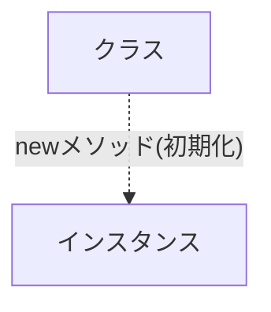

# Exercise - じゃんけんプログラム

## じゃんけんプログラムの仕様

- じゃんけんの手は、グー・チョキ・パーの3つ
- 片方の手は、ランダムに決定する
- 片方の手は、クラスを初期化する際に指定する

## 完成形

まずはじゃんけんプログラムを使って、Rubyの基礎を学びます。

Filename: lib/training/janken.rb

```ruby
# frozen_string_literal: true

module Training
  class Janken
    attr_accessor :inputed_hand, :my_hand

    def initialize(inputed_hand = 0)
      @inputed_hand = inputed_hand
      @my_hand = self.class.my_hand
    end

    def self.my_hand
      rand(3)
    end

    def buttle
      (@inputed_hand - @my_hand + 3) % 3
    end

    def judge
      result = buttle
      if result == 0
        "DRAW"
      elsif result == 1
        "WIN"
      else
        "LOSE"
      end
    end
  end
end

a = Training::Janken.new(0)
puts a.inputed_hand
puts a.my_hand
puts a.buttle
puts a.judge
```

キーワード

> クラス(class), インスタンス(instance), attr_accessorアクセサリ, ゲッター, セッター, メソッド, インスタンス変数, モジュール(module), if文, case式

## じゃんけんプログラムで使うRubyが定義するメソッド（たまに使うが忘れても良い）

### rand メソッド

参考

> [module function Kernel.#rand](https://docs.ruby-lang.org/ja/latest/method/Kernel/m/rand.html)

`rand`メソッドは、疑似乱数を生成するメソッドです。今回は、グー・チョキ・パーの3つの手のうち、ランダムに1つを選択するために使用します(0〜3の範囲の整数をランダムに生成)。

```ruby
def self.my_hand
  rand(3)
end
```

### じゃんけん勝敗ロジック（Rubyメソッドではないが記載）

参考

> [じゃんけん勝敗判定アルゴリズムの思い出](https://staku.designbits.jp/check-janken/)

以下のロジックを使用します

```ruby
def buttle(a,b)
  (a - b + 3) % 3
end
```

## クラスとインスタンス



### Class

クラスは特定の関心事を持つメソッドや定数をまとめたものです。クラスはオブジェクトであり、インスタンスを作成することができます。

```ruby
# frozen_string_literal: true

class Janken
  # メソッド
  # 変数・定数
  # などを定義する
end
```

### Instance

インスタンスは、クラスから生成されたオブジェクトのことを指します。

```ruby
# frozen_string_literal: true

class Janken
  # newメソッドを使用してインスタンスを生成した場合に、initializeメソッドが呼び出される
  def initialize(inputed_hand = 0)
    @inputed_hand = inputed_hand
  end
end

a = Janken.new
```

### Module

Rubyのモジュールは、関連するメソッドや定数をグループ化するための仕組みです。クラスと同じように、モジュールもオブジェクトです。モジュールはインスタンスを作成することはできません。

- 定数やメソッドをまとめる
- クラスに組み込んで多重継承を実現する(ミックスイン)
- 名前空間を提供する

```ruby
# frozen_string_literal: true

module Training
  class Janken
  end
end
```

## 変数とメソッド

参考

> [変数と定数](variables.md) <br>
> [クラス/メソッドの定義](def.md)

### インスタンス変数とインスタンス関数

## ゲッターとセッター

Filename: lib/training/janken.rb

```ruby
# frozen_string_literal: true

module Training
  class Janken
    def initialize(inputed_hand = 0)
      @inputed_hand = inputed_hand
    end

    # Getter
    def inputed_hand
      @inputed_hand
    end

    # Setter
    def inputed_hand=(inputed_hand)
      @inputed_hand = inputed_hand
    end
  end  
end

a = Training::Janken.new(0)
puts a.inputed_hand
#=> 0
```

## アクセサリメソッド

参考

> [instance method Module#attr_accessor](https://docs.ruby-lang.org/ja/latest/method/Module/i/attr_accessor.html)

ゲッター/セッターは、`attr_accessor`メソッドを使用して簡略化して記述することができます。上記コードを`attr_accessor`メソッドを使用して書き直すと以下になります。

```ruby
# frozen_string_literal: true

module Training
  class Janken
    attr_accessor :inputed_hand

    def initialize(inputed_hand = 0)
      @inputed_hand = inputed_hand
    end

    # attr_accessor :inputed_handによって、以下のメソッドが定義される
    # def inputed_hand
    #   @inputed_hand
    # end
    # def inputed_hand=(inputed_hand)
    #   @inputed_hand = inputed_hand
    # end
  end
end

a = Training::Janken.new(0)
puts a.inputed_hand
```

`attr_accessor`メソッドを使用して複数の名前を定義したい場合は、カンマで区切って記述します。

```ruby
# frozen_string_literal: true

module Training
  class Janken
    attr_accessor :inputed_hand, :my_hand, :sample, ...

    # 省略
  end
end
```

`attr_accessor`以外のメソッドもあります。プログラムの要件によって使い分けます。

|  定義式     |  機能  |
|----------|----------|
|  `attr_reader`  |  参照（ゲッター）  |
|  `attr_writer`  |  更新（セッター）  |
|  `attr_accessor`  |  参照&更新（ゲッター/ゲッター）  |

## 演算子式と制御構文

参考

> [演算子式](operator.md) <br>
> [制御構文](control.md)

## おまけ

プログラムは要件によって書き方が変わります。いくつか他の書き方を紹介します。

### 1. case when式を使用したversion

```ruby
# frozen_string_literal: true

module Training
  class Janken
    TXT_DRAW = "DRAW"
    TXT_WIN = "WIN"
    TXT_LOSE = "LOSE"

    attr_accessor :inputed_hand, :my_hand

    def initialize(inputed_hand = 0)
      @inputed_hand = inputed_hand
      @my_hand = self.class.my_hand
    end

    def self.my_hand
      rand(3)
    end

    def buttle
      (@inputed_hand - @my_hand + 3) % 3
    end

    # if文をcase when式に書き換える
    def judge
      case buttle
      when 0
        TXT_DRAW
      when 1
        TXT_WIN
      else
        TXT_LOSE
      end
    end
  end
end

a = Training::Janken.new(0)
puts a.inputed_hand
puts a.my_hand
puts a.buttle
puts a.judge
```

### 2. ハッシュを用いたversion

```ruby
# frozen_string_literal: true

module Training
  class Janken
    TXT_DRAW = "DRAW"
    TXT_WIN = "WIN"
    TXT_LOSE = "LOSE"
    # ハッシュを定義
    RESULT = {
      "0": TXT_DRAW,
      "1": TXT_WIN,
      "2": TXT_LOSE
    }.freeze

    attr_accessor :inputed_hand, :my_hand

    def initialize(inputed_hand = 0)
      @inputed_hand = inputed_hand
      @my_hand = self.class.my_hand
    end

    def self.my_hand
      rand(3)
    end

    def buttle
      (@inputed_hand - @my_hand + 3) % 3
    end

    # ハッシュを用いて結果を返します。条件分岐が不要になります。
    def judge
      RESULT[buttle.to_s.to_sym]
    end

    def test
      RESULT
    end
  end
end

a = Training::Janken.new(0)
puts a.inputed_hand
puts a.my_hand
puts a.buttle
puts a.judge
```