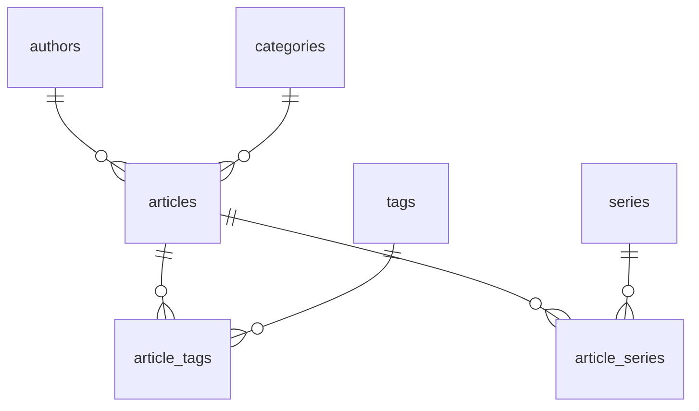
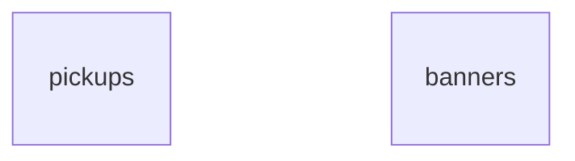
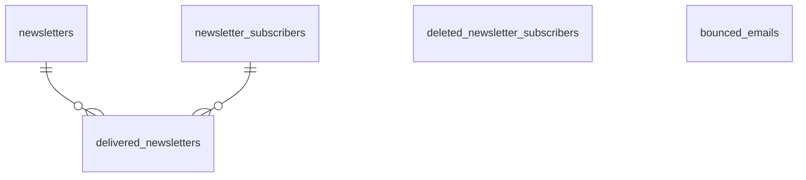
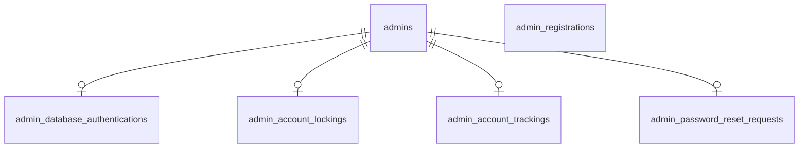
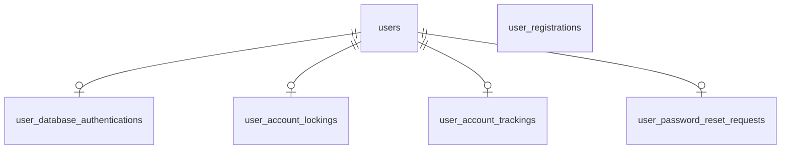

# 本講義プロジェクトMyCMSのER図

## 記事関連ER図

```mermaid
erDiagram
  authors ||--o{ articles : ""
  categories ||--o{ articles : ""
  articles ||--o{ article_tags : ""
  tags ||--o{ article_tags : ""
  articles ||--o{ article_series : ""
  series ||--o{ article_series : ""
```

## メディア関連ER図

```mermaid
erDiagram
  pickups
  banners
```

## ニュースレター関連ER図

```mermaid
erDiagram
  newsletters ||--o{ delivered_newsletters : ""
  newsletter_subscribers ||--o{ delivered_newsletters : ""
  deleted_newsletter_subscribers
  bounced_emails
```

## 管理者関連ER図

```mermaid
erDiagram
  admins ||--o| admin_database_authentications : ""
  admins ||--o| admin_account_lockings : ""
  admins ||--o| admin_account_trackings : ""
  admins ||--o| admin_password_reset_requests : ""
  admin_registrations
```

## ユーザー関連ER図

```mermaid
erDiagram
  users ||--o| user_database_authentications : ""
  users ||--o| user_account_lockings : ""
  users ||--o| user_account_trackings : ""
  users ||--o| user_password_reset_requests : ""
  user_registrations
```