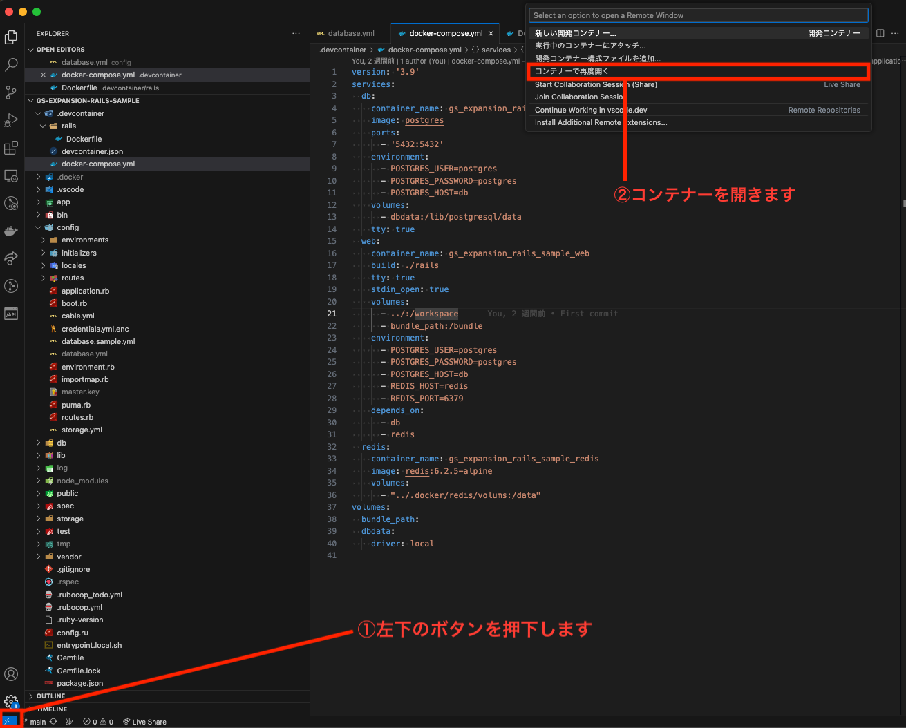
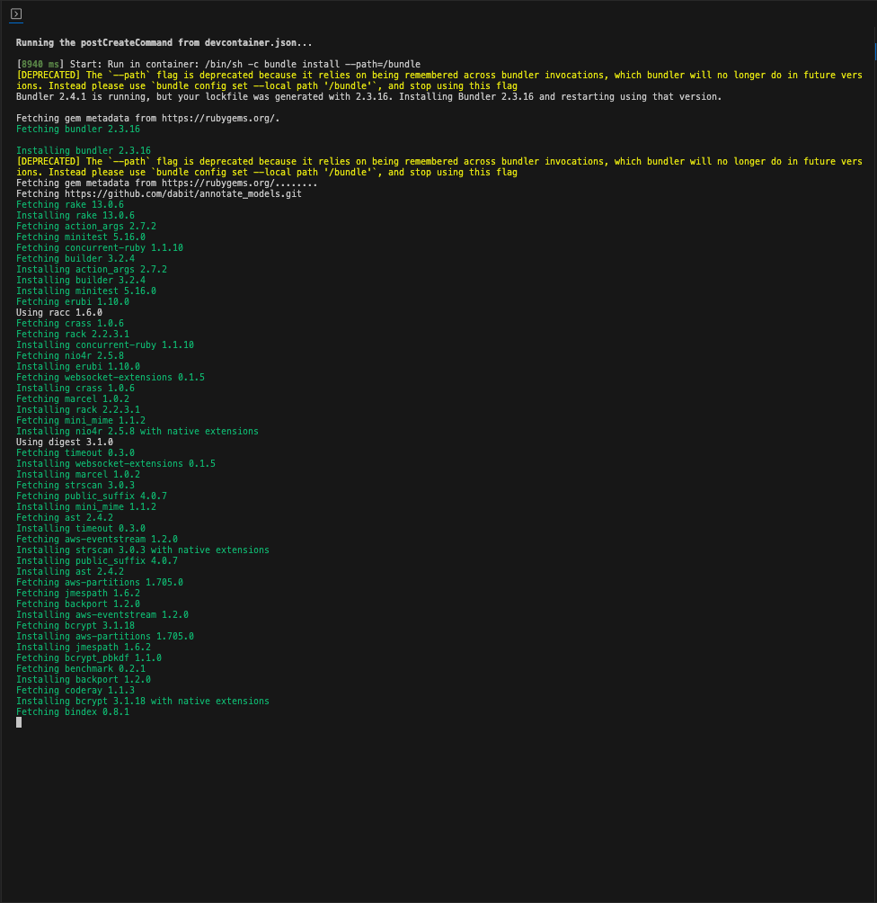
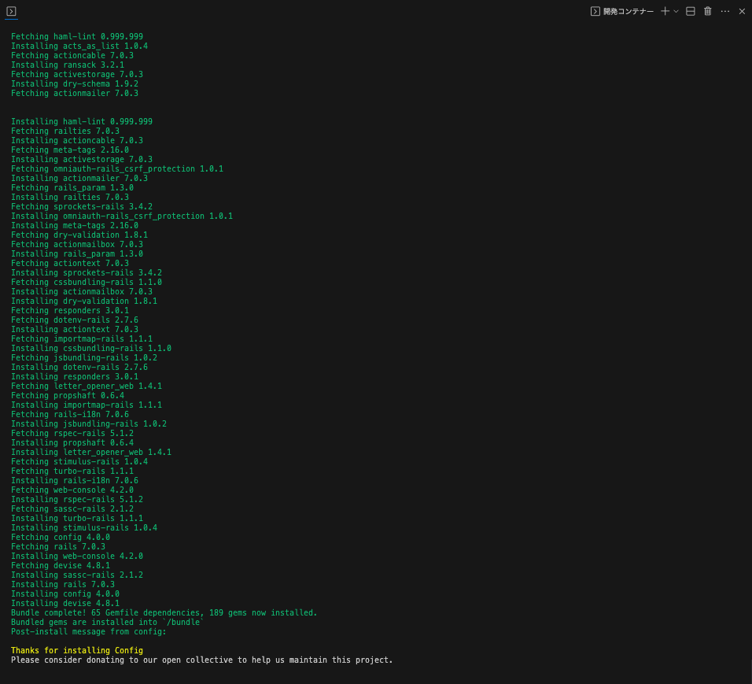
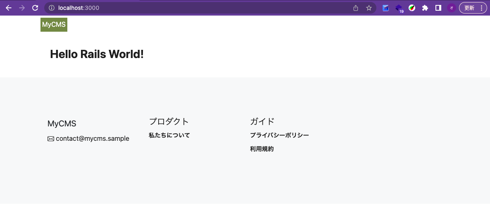
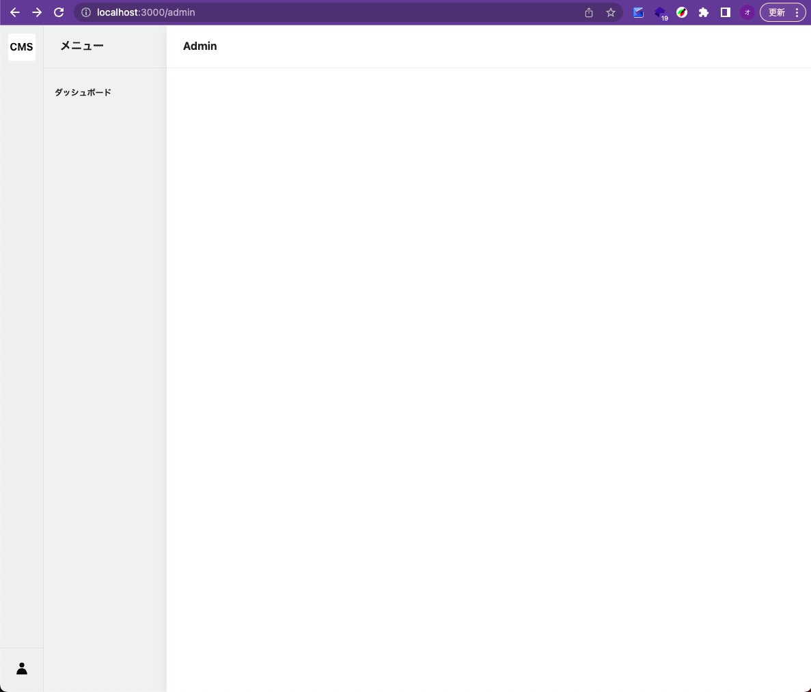

# Ruby on Railsの環境構築

## ソースコードをダウンロードする

まずは今回使用するソースコードを、GithubからHTTPSでクローンします。

Gitをインストールしていない場合は、[こちら](https://git-scm.com/downloads)からインストールしてください。

```console
git clone https://github.com/matakitanakajp09/gs-expansion-rails-sample.git
```

## VSCode Remote Containerでコンテナを起動する

今回の作業ディレクトリ`gs-expansion-rails-sample`に移動します。

```console
cd gs-expansion-rails-sample
```

このディレクトリを、Visual Studio Codeで開きます。

Codeコマンドとは. ターミナルからVSCodeを起動するために用意されたコマンドです。もし、Codeコマンドが使えないor使っていない場合は、VSCodeで直接開いてください。

```console
# ./gs-expansion-rails-sample
code .
```

VSCodeで開いたら、Remote Containerでコンテナを起動します。



起動すると初回のDockerイメージのビルドが始まります。最初は時間がかかるので気長に待ちましょう。



Thanks for installing Config の文字が出れば成功です。



### VSCode内のターミナルを開く

これから実行するコマンドは、作業ディレクトリで実行してください。

```console
pwd
#=> /workspace
```

## Railsを起動する

Railsを起動するために、データベースの設定を行います。

### データベースの設定

`config/database.yml`ファイルは、データベースの接続設定を記述するファイルです。環境ごとに設定を変更することができます。

Rails(puma)が起動すると、config/database.ymlの設定に従ってデータベースの接続を試みます。

Filename: config/database.sample.yml

```console
cp config/database.sample.yml config/database.yml
```

### データベースの確認

db:migrate:statusタスクを実行して、現在のマイグレーションの状態を確認します。

```console
bin/rails db:migrate:status
```

まだデータベースが存在していないので、以下のようなエラーが表示されます。

```console
rails aborted!
ActiveRecord::NoDatabaseError: We could not find your database: gs_expansion_rails_sample_db. Which can be found in the database configuration file located at config/database.yml.

To resolve this issue:

- Did you create the database for this app, or delete it? You may need to create your database.
- Has the database name changed? Check your database.yml config has the correct database name.

To create your database, run:

        bin/rails db:create


Caused by:
PG::ConnectionBad: FATAL:  database "gs_expansion_rails_sample_db" does not exist

Tasks: TOP => db:migrate:status
(See full trace by running task with --trace)
```

### データベースを作成する

開発で使用するデータベースを作成します。

```console
bin/rails db:create
```

```console
Created database 'gs_expansion_rails_sample_db'
```

### マイグレーションを実行する

#### 再度データベースの確認する

```console
bin/rails db:migrate:status
```

まだマイグレーションが実行されていないので、以下のようなエラーが表示されます。

```console
Schema migrations table does not exist yet.
```

#### データベースのマイグレーションを行う

初回のマイグレーションを行います。

```console
bin/rails db:migrate
```

以下のように表示されれば成功です。

```console
bin/rails db:migrate
== 20230521111713 CreateActiveStorageTables: migrating ========================
-- create_table(:active_storage_blobs, {:id=>:uuid})
   -> 0.0227s
-- create_table(:active_storage_attachments, {:id=>:uuid})
   -> 0.0227s
-- create_table(:active_storage_variant_records, {:id=>:uuid})
   -> 0.0124s
== 20230521111713 CreateActiveStorageTables: migrated (0.0580s) ===============

== 20230521112655 CreateUsers: migrating ======================================
-- create_table(:users, {:id=>:uuid})
   -> 0.0050s
== 20230521112655 CreateUsers: migrated (0.0051s) =============================

== 20230521113755 CreateUserRegistrations: migrating ==========================
-- create_table(:user_registrations, {:id=>:uuid})
   -> 0.0128s
-- add_index(:user_registrations, :confirmation_token, {:unique=>true})
   -> 0.0040s
-- add_index(:user_registrations, :unconfirmed_email, {:unique=>true})
   -> 0.0025s
== 20230521113755 CreateUserRegistrations: migrated (0.0195s) =================

== 20230521113756 CreateUserDatabaseAuthentications: migrating ================
-- create_table(:user_database_authentications, {:id=>false, :primary_key=>"user_id"})
   -> 0.0130s
-- add_index(:user_database_authentications, :email, {:unique=>true})
   -> 0.0024s
== 20230521113756 CreateUserDatabaseAuthentications: migrated (0.0155s) =======

== 20230521113757 CreateUserAccountLockings: migrating ========================
-- create_table(:user_account_lockings, {:id=>false, :primary_key=>"user_id"})
   -> 0.0144s
-- add_index(:user_account_lockings, :unlock_token, {:unique=>true})
   -> 0.0026s
== 20230521113757 CreateUserAccountLockings: migrated (0.0171s) ===============

== 20230521113758 CreateUserAccountTrackings: migrating =======================
-- create_table(:user_account_trackings, {:id=>false, :primary_key=>"user_id"})
   -> 0.0173s
== 20230521113758 CreateUserAccountTrackings: migrated (0.0180s) ==============

== 20230521113759 CreateUserPasswordResetRequests: migrating ==================
-- create_table(:user_password_reset_requests, {:id=>false, :primary_key=>"user_id"})
   -> 0.0125s
-- add_index(:user_password_reset_requests, :reset_password_token, {:unique=>true})
   -> 0.0031s
== 20230521113759 CreateUserPasswordResetRequests: migrated (0.0162s) =========

== 20230522112655 CreateAdmins: migrating =====================================
-- create_table(:admins, {:id=>:uuid})
   -> 0.0071s
== 20230522112655 CreateAdmins: migrated (0.0072s) ============================

== 20230522113755 CreateAdminRegistrations: migrating =========================
-- create_table(:admin_registrations, {:id=>:uuid})
   -> 0.0149s
-- add_index(:admin_registrations, :confirmation_token, {:unique=>true})
   -> 0.0028s
-- add_index(:admin_registrations, :unconfirmed_email, {:unique=>true})
   -> 0.0044s
== 20230522113755 CreateAdminRegistrations: migrated (0.0225s) ================

== 20230522113756 CreateAdminDatabaseAuthentications: migrating ===============
-- create_table(:admin_database_authentications, {:id=>false, :primary_key=>"admin_id"})
   -> 0.0156s
-- add_index(:admin_database_authentications, :email, {:unique=>true})
   -> 0.0022s
== 20230522113756 CreateAdminDatabaseAuthentications: migrated (0.0179s) ======

== 20230522113757 CreateAdminAccountLockings: migrating =======================
-- create_table(:admin_account_lockings, {:id=>false, :primary_key=>"admin_id"})
   -> 0.0185s
-- add_index(:admin_account_lockings, :unlock_token, {:unique=>true})
   -> 0.0039s
== 20230522113757 CreateAdminAccountLockings: migrated (0.0225s) ==============

== 20230522113758 CreateAdminAccountTrackings: migrating ======================
-- create_table(:admin_account_trackings, {:id=>false, :primary_key=>"admin_id"})
   -> 0.0188s
== 20230522113758 CreateAdminAccountTrackings: migrated (0.0189s) =============

== 20230522113759 CreateAdminPasswordResetRequests: migrating =================
-- create_table(:admin_password_reset_requests, {:id=>false, :primary_key=>"admin_id"})
   -> 0.0135s
-- add_index(:admin_password_reset_requests, :reset_password_token, {:unique=>true})
   -> 0.0042s
== 20230522113759 CreateAdminPasswordResetRequests: migrated (0.0178s) ========

== 20230529075027 CreateAuthors: migrating ====================================
-- create_table(:authors, {:id=>:uuid})
   -> 0.0118s
== 20230529075027 CreateAuthors: migrated (0.0119s) ===========================

== 20230529085435 CreateCurrentStatusEnum: migrating ==========================
-- create_enum(:current_status, ["draft", "published", "archived", "trashed"])
   -> 0.0048s
== 20230529085435 CreateCurrentStatusEnum: migrated (0.0053s) =================

== 20230529085530 CreateCategories: migrating =================================
-- create_table(:categories, {:id=>:uuid})
   -> 0.0085s
== 20230529085530 CreateCategories: migrated (0.0086s) ========================

== 20230529113755 CreateActionTextTables: migrating ===========================
-- create_table(:action_text_rich_texts, {:id=>:uuid})
   -> 0.0110s
== 20230529113755 CreateActionTextTables: migrated (0.0111s) ==================
```

### 静的ファイル関連設定

esbuildとsassをインストールします

```bash
bin/rails javascript:install:esbuild
```

```bash
bin/rails css:install:sass
```

### Rails(puma)を起動する

Railsを起動するには、以下のコマンドを実行します。

```bash
bin/rails s
```

ターミナルに以下のような表示が出たら、Railsが起動しています。

```console
=> Booting Puma
=> Rails 7.0.3 application starting in development 
=> Run `bin/rails server --help` for more startup options
Puma starting in single mode...
* Puma version: 5.6.4 (ruby 3.1.2-p20) ("Birdie's Version")
*  Min threads: 5
*  Max threads: 5
*  Environment: development
*          PID: 5305
* Listening on http://127.0.0.1:3000
Use Ctrl-C to stop

```

ブラウザで`http://localhost:3000`にアクセスしてみましょう。



ブラウザで`http://localhost:3000/admin`にアクセスしてみましょう。



以下の画面が表示されれば環境構築は完了です。

#### Railsが起動しない場合

以下のような表示が出た場合は、すでにRailsが起動しているので、一度停止してから再度実行してください。

```console
bin/rails s
=> Booting Puma
=> Rails 7.0.3 application starting in development 
=> Run `bin/rails server --help` for more startup options
A server is already running. Check /workspace/tmp/pids/server.pid.
Exiting
```

#### pumaのプロセスを確認する

```bash
ps aux | grep puma
```

例えば以下の場合、`800`がpumaのプロセスIDです。プロセスIDを指定してkillコマンドを実行すると、pumaを停止することができます。

```console
root       800  0.2  1.8 1028168 149416 pts/1  Sl+  12:17   0:02 puma 5.6.4 (tcp://localhost:3000) [workspace]
root      4351  0.0  0.0   4796   640 pts/2    S+   12:32   0:00 grep puma
```

以下のコマンドを実行して、pumaを停止します。

```bash
kill -9 800
```

プロセスがkillされていることを確認します。

```bash
ps aux | grep puma
root      4509  0.0  0.0   4796   632 pts/2    S+   12:32   0:00 grep puma
```

再度、`bin/rails s`を実行して、Railsを起動します。

これでRuby, Railsの環境構築は終了です。
