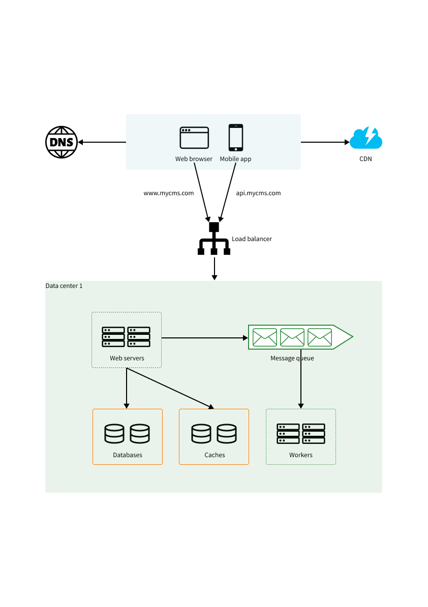
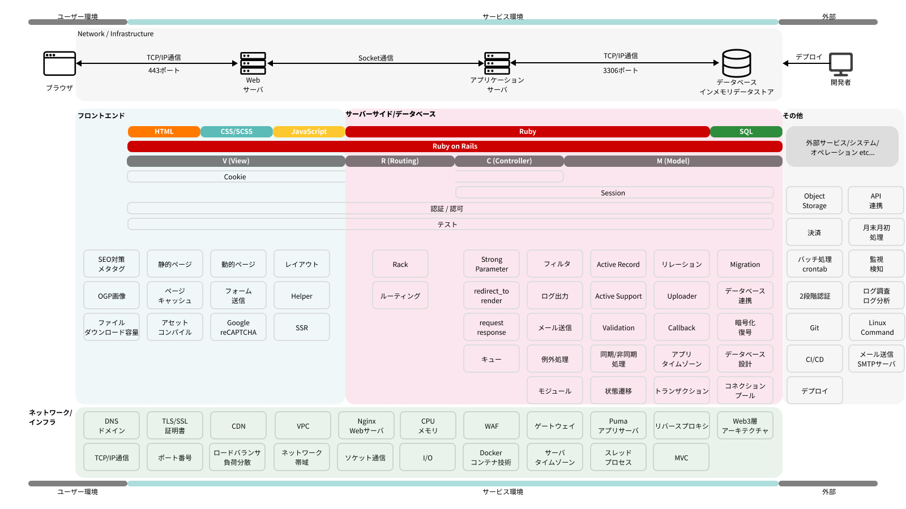

# Ruby on Railsを用いたWeb開発の全体像

<!-- - [Webサーバとアプリケーションサーバの理解](day-0/web-and-application-server.md)
- [MVC+MR(ミドルウェア、ルーティング)基礎](day-0/mvc-architecture-and-routing.md)
- [フォルダ/ファイルの関係性](day-0/folders-and-files.md)
- [データベース管理とマイグレーション](day-0/databse-management-and-migration.md) -->

## Web開発で理解したい大枠の知識

以下に記載する知識は、Ruby on Railsに限らず、Python、PHP、Java、JavaScriptなどの言語を用いたWeb開発においても必要な知識です。複雑な知識が多いため、理解するのに時間がかかると思いますが、理解することで、Web開発の全体像が見えてきます。

|  用語  |  名称  |  説明  |
|----------|----------|----------|
|  `DNS`  |  `Domain Name System`  |  `ドメイン名とIPアドレスの対応付けや、 メールの宛先ホストを指示するためのシステム`  |
|  `IP address`, `IPアドレス`  |  `Internet Protocol Address`  |  `通信相手を識別するための番号`  |
|  `Server`, `サーバ`  |  `サーバ`  |  `クライアントからのリクエストに応じて、データや処理結果などを提供する機能を果たす側のシステムやソフトウェア`  |
|  `HTTP`  |  `Hypertext Transfer Protocol`  |  `通信プロトコル`  |
|  `Database`, `DB`  |  `Database`  |  `電子的に保存され、アクセスできる組織化されたデータの集合。RDB、NoSQLなどの種類がある`  |
|  `Scale up`, `Vertical scaling` |  `スケールアップ`  |  `サーバそのもののパフォーマンスを向上させることでシステムの処理機能を高める`  |
|  `Scale out`, `Horizontal scaling` |  `スケールアウト`  |  `サーバを増やすことでシステムの処理機能を高める`  |
|  `Load balancer` |  `ロードバランサ`  |  `外部からの通信（トラフィック）を複数のサーバーに分散する仕組みを提供する装置`  |
|  `Database replication` |  `データベースレプリケーション`  |  `データベースを複製すること。source/replica構成ともいう(master/slaveは廃止)。`  |
|  `Cache` |  `キャッシュ`  |  `データなどを一時的に保存し、次回に表示する際にこのデータを使いすばやく表示する機能`  |
|  `CDN` |  `Content delivery network`  |  `インターネットコンテンツを高速配信するために連携する地理的に分散されたサーバーのグループ`  |
|  `Message queue` |  `メッセージキュー`  |  `システム間で流れるデータ（メッセージ）をためておくキュー`  |
|  `Logging`, `Metrics`, `Monitoring`, `Automation` |  `ログ`, `メトリクス`, `モニタリング`, `オートメーション`  |  `サービス運用上で必要な機能や指標`  |
|  `Latency` |  `レイテンシ`  |  `データ転送における指標の一つ。通信の遅延時間のことを指す`  |
|  `WAF` |  `Web Application Firewall`  |  `Webアプリケーションの脆弱性を悪用した攻撃」からWebサイトを保護するセキュリティ対策`  |
|  `Object Storage` |  `オブジェクトストレージ`  |  `非構造化データを保存するためのデータ ストレージ アーキテクチャのこと。S3, Cloud Storage, Filestore, R2などの製品がオブジェクトストレージに当たります。`  |
|  `Data centers` |  `データセンター`  |  `各種のコンピュータ（メインフレーム、ミニコンピュータ、サーバ等）やデータ通信などの装置を設置・運用することに特化した施設の総称`  |

## web開発でよく見る一般的な構成

## Ruby on Railsを理解するための図解

