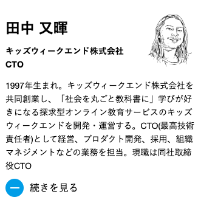

# Day1 講義用ページ

## このページの目的

「【G's EXPANSION】 爆速で身に着けるRuby on Rails：自分だけのCMSを開発しよう！」のDay1の講義用ページです。

## 今日の講義の目的

- 答えをお伝えするのではなく、答えを見つけるための武器をお伝えする
- Railsの基礎を学ぶ
- MVCとルーティングについて理解する
- エラーが出た時の対処法を学ぶ

## Day1講義の流れ

- 自己紹介
- ハンズオンの準備
- ハンズオン
- 質問会

## 自己紹介

"[G's ACADEMY HP](https://gsacademy.jp/mentor-lecturer)から引用"

### キッズウィークエンド

「社会を丸ごと教科書に」学びが好きになる探究型オンライン教育のキッズウィークエンドです。子育てとキャリアのトレードオフを解消し誰もが挑戦できる社会を目指して事業展開しています。

- 2020年4月スタート（サービス開始3年）
- 子育て世帯の狭いターゲットで、会員登録者は4万5千人超
- 累計500万PV超のwebサービスを開発
- 18万人以上の親子が参加
- Ruby on Railsで開発
- テスト版を含めて4年くらい同じサービスを開発してます
- フロントエンド/サーバーサイド/インフラ/デザイン/データ分析/PM/CSなどやってます
- テーブル数は200ほど(小規模サービス)

#### 個人

- Ruby/Rust/TypeScrpt/Next.js/Python/Goなどが好きです
- 10ヶ月の息子がいます
- オーマイライク株式会社の代表をやっていて、たまに案件を受けたりサービスを作ったりしてます

## Day1のハンズオン準備

[Day1のハンズオン準備](./handson.md)を使用します。

## 質問会

Ruby, Railsに関する質問を受け付けます。

## Day2に向けたハンズオン

[Day1のハンズオン準備](./handson.md)を使用します。
