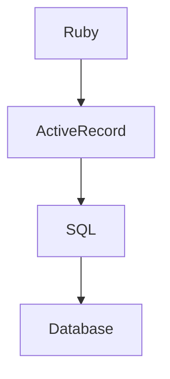

# Day1 QA

## Q. デプロイサービス

### A. 簡単なのは、Heroku, render, Fly.ioあたりかと思います。

- [LOLIPOP!マネージドクラウド](https://mc.lolipop.jp/)
- [Heroku](https://jp.heroku.com/)
- [render](https://render.com/)
- [Fly.io](https://fly.io/)
- [Linode](https://www.linode.com/ja/)
- [AWS](https://aws.amazon.com/jp/)
- [GCP](https://cloud.google.com/?hl=ja)
- [Azure](https://azure.microsoft.com/ja-jp)


## Q. APIモード

### A. Rails6から追加されたモードです。Railsの機能をAPIとして提供することができます。

1. `config/application.rb`に以下を追加すると、APIモードになります。

```ruby
config.api_only = true
```

2. `app/controllers/application_controller.rb`を以下のように変更します。

```ruby
class ApplicationController < ActionController::API
end
```

3. 例えば、こんな感じです

```ruby
def index
  users = User.all
  render json: { data: users }
end
```

※ ActiveRecordは基本的には、すべてのデータを返してしまうので、Serializerを使って、必要なデータだけを返すようにすると良いかと思います。

## Q. SQLがたくさん発生するケースは？

### A. 集計系や検索系

お金やデータ集計などでSQLが大量に発生するケースがあります。その場合は、

- ActiveRecordで書く
- 直接SQLを書く
  - `ActiveRecord::Base.connection.execute`などを使用します。

具体的には、会社ごとやユーザーごとに毎月の売上を集計するようなケースです。

## 蛇足

ActiveRecordは、データベースと連携するためのライブラリです。データベースの操作を抽象化して、Rubyのコードでデータベースを操作できるようにしています。最終的には、SQLを発行してデータベースを操作しています。

流れとしては、



大量にデータを扱う際は、

- 直接SQLを書く
  - そのまま配列などで扱う
  - ※SQLからActiveRecordに戻すとコストがかかるので遅くなる
- DB設計を工夫する
  - マテリアライズドビューやビューを活用する
  - 集計用のテーブルを作成する
  - データを分割する
- Redisなどのキャッシュを活用する