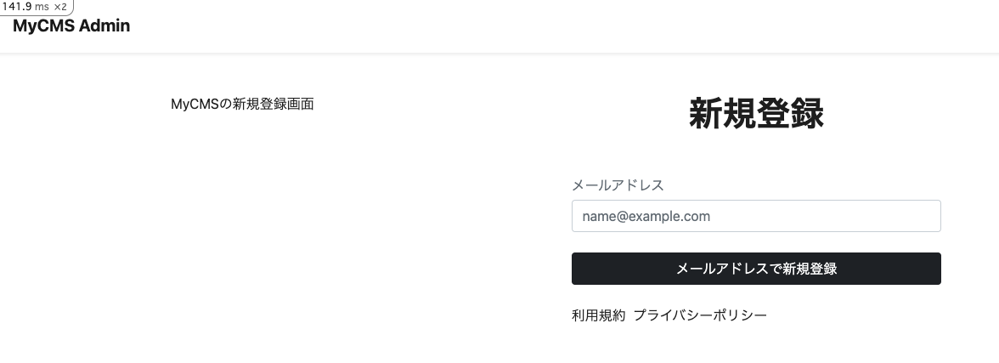
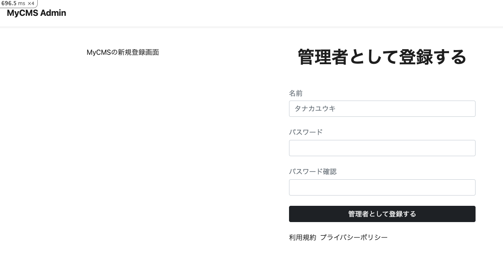
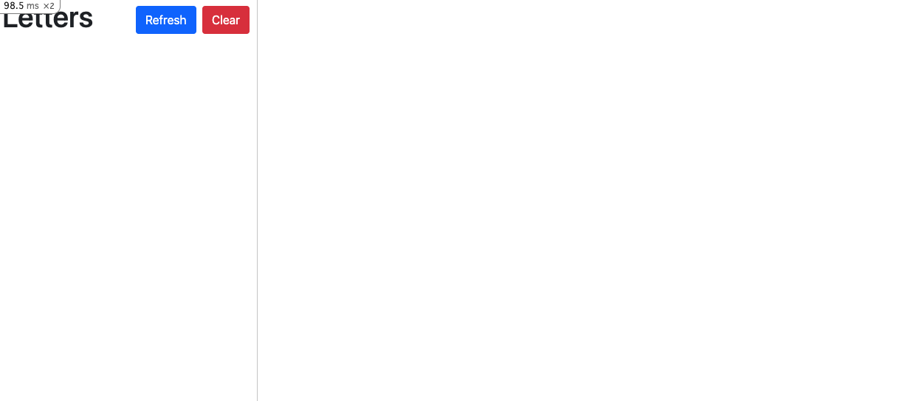
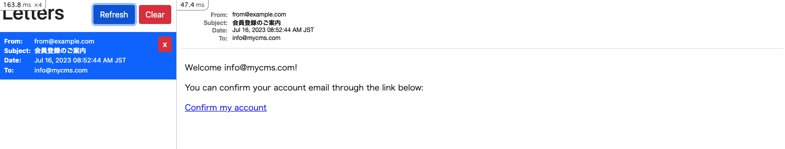

# 認証機能: 新規登録

管理者アカウントの新規登録機能を実装します。

> [Devise RegistrationsController](https://github.com/heartcombo/devise/blob/main/app/controllers/devise/registrations_controller.rb)

## 新規登録の流れ

1. 管理者アカウントの新規登録画面でメールアドレスを入力して送信
2. メールアドレスが登録済みかどうかを確認し、メールアドレスを認証するためのリンクが添付されたメールを送信
3. 認証リンクをクリックし、管理者アカウント情報を入力して登録完了
4. ログインする

## ルーティングの設定

[code]

`config/routes/admin/devise.rb`に以下のルーティングを追加します。

```ruby
# frozen_string_literal: true

Rails.application.routes.draw do
  # 省略

  # 以下パスに変更
  devise_scope :admin_registration do
    post "admin/registration/finish", to: "admin/registrations#finish", as: "finish_admin_registration"
  end
end
```

[command]

`bin/rails routes -g admin/registration/finish`を実行して、ルーティングが追加されていることを確認します。

```bash
bin/rails routes -g admin/registration/finish
```

[output]

```bash
/workspace# bin/rails routes -g admin/registration/finish
                   Prefix Verb URI Pattern                          Controller#Action
finish_admin_registration POST /admin/registration/finish(.:format) admin/registrations#finish
```

ルーティングが追加されていることを確認することができました。

## コントローラーの作成

[command]

```bash
touch app/controllers/admin/registrations_controller.rb
```

[code]

`app/controllers/admin/registrations_controller.rb`を以下のように編集します。

```ruby
# frozen_string_literal: true

class Admin::RegistrationsController < Devise::ConfirmationsController
  layout "admin/auth"

  # GET /resource/confirmation/new
  def new
    super
  end

  # POST /resource/confirmation
  def create
    registered = Admin::DatabaseAuthentication.where(email: params[:registration][:email]).exists?
    if registered
      flash[:error] = "Given email address is already registered."
      return render :new
    end
    admin_registration = Admin::Registration.find_or_initialize_by(unconfirmed_email: params[:registration][:email])
    if admin_registration.save
      Admin::DeviseMailer.confirmation_instructions(admin_registration).deliver_now
      flash[:notice] = "Sending an email confirmation instruction"
      redirect_to new_admin_database_authentication_session_path and return
    else
      respond_with(admin_registration)
    end
  end

  # GET /resource/confirmation?confirmation_token=abcdef
  def show
    @admin = Admin.new
    @admin_database_authentication = Admin::DatabaseAuthentication.new
  end

  def finish
    admin_registration = Admin::Registration.confirm_by_token(params[:confirmation_token])
    ActiveRecord::Base.transaction do
      @admin = Admin.new(full_name: params[:full_name])
      @admin_database_authentication = Admin::DatabaseAuthentication.new(
        admin: @admin,
        email: admin_registration&.unconfirmed_email,
        password: params[:password],
        password_confirmation: params[:password_confirmation]
      )
      @admin.save!
      @admin_database_authentication.save!
      admin_registration.destroy!
    end

    sign_in(:admin, @admin)
    sign_in(:database_authentication, @admin_database_authentication)

    redirect_to new_admin_database_authentication_session_path
  rescue StandardError
    render :show
  end
end
```

## ビューの作成

[command]

```bash
mkdir -p app/views/admin/registrations && touch app/views/admin/registrations/new.html.erb && touch app/views/admin/registrations/show.html.erb
```

[code]

`app/views/admin/registrations/new.html.erb`を以下のように編集します。

```erb
<main>
  <div class="">
    <div class="row">
      <div class="col">
        <div class="py-5 d-flex justify-content-center align-items-center">
          MyCMSの新規登録画面
        </div>
      </div>
      <div class="col">
        <div class="py-5 d-flex justify-content-center align-items-center">
          <div class="w-75 mx-3">
            <h1 class="text-center fw-bold">ログイン</h1>
            <div class="w-100 mx-auto mt-5">
              <%= form_for(resource, as: resource_name, url: admin_registration_confirmation_path) do |f| %>
                <div class="mt-4">
                  <label for="email" class="mb-1 form-label text-small text-muted">メールアドレス</label>
                  <input type="email" class="form-control" id="email" placeholder="name@example.com" name="registration[email]">
                </div>
                <div class="mt-4">
                  <button class="btn btn-dark w-100">
                    メールアドレスで新規登録
                  </button>
                </div>
              <% end %>
              <ul class="mt-4 d-flex">
                <li class="me-2 text-muted">
                  <a href="/terms">利用規約</a>
                </li>
                <li class="me-2 text-muted">
                  <a href="/privacy">プライバシーポリシー</a>
                </li>
              </ul>
            </div>
          </div>
        </div>
      </div>
    </div>
  </div>
</main>
```

[output]

以下にアクセスして、以下のような画面が表示されることを確認します。

[http://localhost:3000/admin/confirmation/new](http://localhost:3000/admin/confirmation/new)



---

[code]

`app/views/admin/registrations/show.html.erb`を以下のように編集します。

```erb
<main>
  <div class="">
    <div class="row">
      <div class="col">
        <div class="py-5 d-flex justify-content-center align-items-center">
          MyCMSの新規登録画面
        </div>
      </div>
      <div class="col">
        <div class="py-5 d-flex justify-content-center align-items-center">
          <div class="w-75 mx-3">
            <h1 class="text-center fw-bold">管理者として登録する</h1>
            <div class="w-100 mx-auto mt-5">
              <%= form_tag(finish_admin_registration_path) do |f| %>
                <input type="hidden" name="confirmation_token" value="<%= params[:confirmation_token] %>">
                <div class="mt-4">
                  <label for="full_name" class="mb-1 form-label text-small text-muted">名前</label>
                  <input type="text" class="form-control" id="full_name" placeholder="タナカユウキ" name="full_name">
                </div>
                <div class="mt-4">
                  <label for="password" class="mb-1 form-label text-small text-muted">パスワード</label>
                  <input type="password" class="form-control" id="password" name="password">
                </div>
                <div class="mt-4">
                  <label for="password_confirmation" class="mb-1 form-label text-small text-muted">パスワード確認</label>
                  <input type="password" class="form-control" id="password_confirmation" name="password_confirmation">
                </div>
                <div class="mt-4">
                  <button class="btn btn-dark w-100">
                    管理者として登録する
                  </button>
                </div>
              <% end %>
              <ul class="mt-4 d-flex">
                <li class="me-2 text-muted">
                  <a href="/terms">利用規約</a>
                </li>
                <li class="me-2 text-muted">
                  <a href="/privacy">プライバシーポリシー</a>
                </li>
              </ul>
            </div>
          </div>
        </div>
      </div>
    </div>
  </div>
</main>
```

[output]

以下にアクセスして、以下のような画面が表示されることを確認します。

[http://localhost:3000/admin/confirmation](http://localhost:3000/admin/confirmation)




## Mailerの作成

Railsでのメール送信には、`ActionMailer`を使います。`ActionMailer`は、メールの送信に必要なメソッドを提供します。

[command]

```bash
touch app/mailers/admin/devise_mailer.rb
```

[code]

`app/mailers/admin/devise_mailer.rb`を以下のように編集します。

```ruby
# frozen_string_literal: true

class Admin::DeviseMailer < Admin::ApplicationMailer
  default from: "from@example.com"
  layout "mailer"

  def confirmation_instructions(resource)
    subject = "会員登録のご案内"
    template_path = "admin/mailer/devise"
    template_name = "confirmation_instructions"
    @token = resource&.confirmation_token
    @email = resource&.unconfirmed_email

    mail(
      to: @email,
      subject: subject,
      template_path: template_path,
      template_name: template_name
    )
  end
end
```

`config/initilizers/devise.rb`に以下を追加します。

```ruby
config.mailer = 'Admin::DeviseMailer'
```

#### メールのテンプレートの作成

[command]

```bash
mkdir -p app/views/admin/mailer/devise && touch app/views/admin/mailer/devise/confirmation_instructions.html.erb
```

[code]

`app/views/admin/mailer/devise/confirmation_instructions.html.erb`を以下のように編集します。

```erb
<p>Welcome <%= @email %>!</p>

<p>You can confirm your account email through the link below:</p>

<p><%= link_to 'Confirm my account', admin_registration_confirmation_url(confirmation_token: @token) %></p>

```

#### Letter Opener Webの設定

Letter Opener Webを使って、メールの送信内容を確認できるようにします。

[code]

`Gemfile`を以下のように編集します。

```ruby
gem "letter_opener_web", "~> 2.0"
```

[command]

```bash
bundle install
```

[code]

`config/routes.rb`を以下のように編集します。

```ruby
mount LetterOpenerWeb::Engine, at: "/letter_opener" if Rails.env.development? || Rails.env.staging?
```

[code]

`config/environments/development.rb`に以下を追加します。

```ruby
config.action_mailer.default_url_options = { host: "localhost:3000" }
config.action_mailer.delivery_method = :letter_opener_web
```

サーバーを再起動して、以下にアクセスして、以下のような画面が表示されることを確認します。

[http://localhost:3000/letter_opener](http://localhost:3000/letter_opener)



## 管理者アカウント新規登録

[try]

以下の画面から、メールアドレスを入力して管理者アカウントの新規登録を行います。
`info@mycms.com`を入力してみます。

[http://localhost:3000/admin/confirmation/new](http://localhost:3000/admin/confirmation/new)

メールアドレスを入力して送信すると、Letter Opener Webの画面で以下のようなメールが表示されます。

[http://localhost:3000/letter_opener/](http://localhost:3000/letter_opener/)



---

メールのリンクをクリックすると、以下のような画面が表示されます。

`app/controllers/admin/registrations_controller.rb`で定義した`show`アクションが呼び出されています。


名前、パスワード、パスワード確認を入力して送信して、管理者アカウントの新規登録は完了です。

