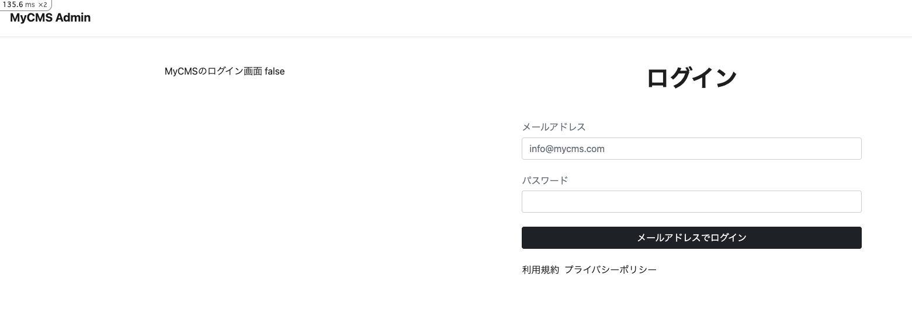
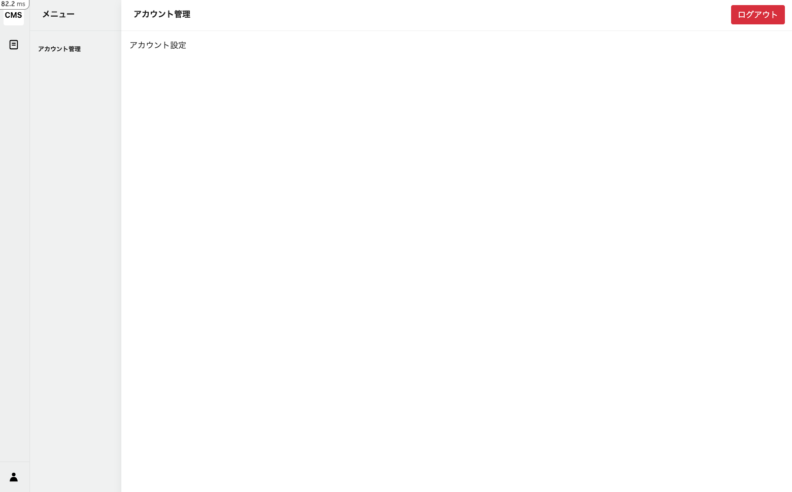

# 認証機能: ログイン

管理者アカウントのログイン機能を実装します。

> [Devise: SessionsController](https://github.com/heartcombo/devise/blob/main/app/controllers/devise/sessions_controller.rb)

## 新規登録の流れ

1. 管理者アカウントのログイン画面でメールアドレスとパスワードを入力して送信
2. メールアドレスとパスワードが正しいかどうかを確認し、ログインする

## ルーティングの設定

すでに設定済みなので、特に設定する必要はありません。

## コントローラーの作成

`app/controllers/admin/database_authentication/sessions_controller.rb`の`new`と`destroy`メソッドのコメントアウトを外します。

```ruby
# frozen_string_literal: true

class Admin::DatabaseAuthentication::SessionsController < Devise::SessionsController
  # 省略

  def new
    super
  end

  def destroy
    super
  end
end
```

## ビューの作成

[code]

`app/views/admin/database_authentication/sessions/new.html.erb`を作成します。

```ruby
<main>
  <div class="">
    <%= render :partial => "admin/flash" %>
    <div class="row">
      <div class="col">
        <div class="py-5 d-flex justify-content-center align-items-center">
          MyCMSのログイン画面
          <%= admin_signed_in? %>
        </div>
      </div>
      <div class="col">
        <div class="py-5 d-flex justify-content-center align-items-center">
          <div class="w-75 mx-3">
            <h1 class="text-center fw-bold">ログイン</h1>
            <div class="w-100 mx-auto mt-5">
              <%= form_for(resource, as: resource_name, url: admin_database_authentication_session_path) do |f| %>
                <div class="mt-4">
                  <%= f.label :email, class: "mb-1 form-label text-small text-muted" do %>
                    メールアドレス
                  <% end %>
                  <%= f.email_field :email, autofocus: true, autocomplete: "email", class: "form-control", placeholder: "info@mycms.com" %>
                </div>
                <div class="mt-4">
                  <%= f.label :password, class: "mb-1 form-label text-small text-muted" do %>
                    パスワード
                  <% end %>
                  <%= f.password_field :password, autocomplete: "current-password", class: "form-control" %>
                </div>
                <div class="mt-4">
                  <%= f.submit "メールアドレスでログイン", class: "btn btn-dark w-100" %>
                </div>
              <% end %>
              <ul class="mt-4 d-flex">
                <li class="me-2 text-muted">
                  <a href="/terms">利用規約</a>
                </li>
                <li class="me-2 text-muted">
                  <a href="/privacy">プライバシーポリシー</a>
                </li>
              </ul>
            </div>
          </div>
        </div>
      </div>
    </div>
  </div>
</main>
```

[output]

以下にアクセスして、以下のような画面が表示されることを確認します。

[http://localhost:3000/admin/sign_in](http://localhost:3000/admin/sign_in)




## 管理者アカウントのログイン

email: info@mycms.com

password: password

ログイン後、以下のダッシュボード画面にリダイレクトすると、ログインが成功しています。

[http://localhost:3000/admin](http://localhost:3000/admin)

## ログイン状態のみ


## アカウント設定画面

### ルーティング設定

[command]

```bash
touch config/routes/settings.rb
```

```ruby
# frozen_string_literal: true

Rails.application.routes.draw do
  namespace :admin do
    resources :settings
  end
end
```

### コントローラーの作成

[command]

```bash
touch app/controllers/admin/settings_controller.rb
```

[code]

`app/controllers/admin/settings_controller.rb`を作成します。

```ruby
# frozen_string_literal: true

class Admin::SettingsController < Admin::ApplicationController
  def index; end
end
```

### ビューの作成

[command]

```bash
mkdir -p app/views/admin/settings && mkdir -p app/views/admin/settings/breadcrumb && touch app/views/admin/settings/breadcrumb/_index.html.erb && touch app/views/admin/settings/index.html.erb
```

[code]

`app/views/admin/settings/index.html.erb`を作成します。

```erb
<div class="l-container">
  <%= render partial: "layouts/admin/setting_menu" %>
  <div class="l-main-view">
    <div class="sw-main-header">
      <div class="sw-main-header-title">アカウント管理</div>
      <div class="sw-main-header-buttons">
        <div class="sw-main-header-button">
          <%= link_to destroy_admin_database_authentication_session_path, class: "btn btn-danger", data: { turbo_method: :delete }  do %>
            ログアウト
          <% end %>
        </div>
      </div>
    </div>
    <div class="sw-main-body">
      <ul class="breadcrumb p-3">
        <%= render partial: "admin/settings/breadcrumb/index" %>
      </ul>
    </div>
  </div>
</div>
```

[code]

`app/views/admin/settings/breadcrumb/_index.html.erb`を作成します。

```erb
<li>
  <%= link_to admin_settings_path do %>
    <%= t ".title" %>
  <% end %>
</li>
```

[command]

```bash
touch app/views/layouts/admin/_setting_menu.html.erb
```

[code]

```erb
<div class="l-side">
  <div class="sw-main-header">
    <div class="sw-main-header-title">メニュー</div>
  </div>
  <div class="sw-main-body">
    <div class="user-links">
      <div class="sw-menu">
        <ul class="sw-menu-link">
          <li>
            <%= link_to admin_settings_path do %>
              <span><%= t ".setting" %></span>
            <% end %>
          </li>
        </ul>
      </div>
    </div>
  </div>
</div>
```

### 翻訳ファイルの追加

[code]

`config/locales/ja.yml`を以下のようにSettings部分を追加します。

```yaml
    settings:
      breadcrumb:
        index:
          title: アカウント設定
      index:
        title: アカウント設定
```

[code]

`config/locales/layouts/ja.yml`を以下のように追加します。

```yaml
      setting_menu:
        setting: アカウント管理
```

### 既存のリンクパスを修正

[code]

`app/views/layouts/admin/_sidemenu.html.erb`を以下のように修正します。

```erb
<a class="function-button" aria-current="true" data-bs-placement="right" data-bs-toggle="tooltip" title="アカウント/設定" href="/admin/settings">
```

### 画面の確認

以下にアクセスして、以下のような画面が表示されることを確認します。

[http://localhost:3000/admin/settings](http://localhost:3000/admin/settings)



### ログアウト

右上のログアウトボタンを押下して、ログアウトします。