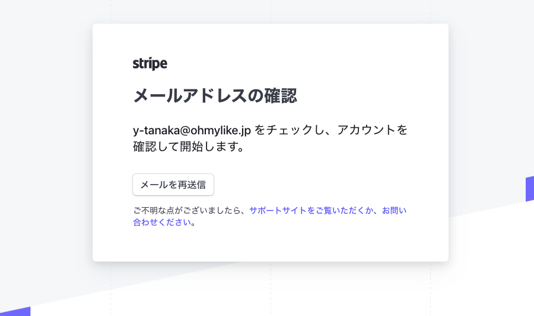
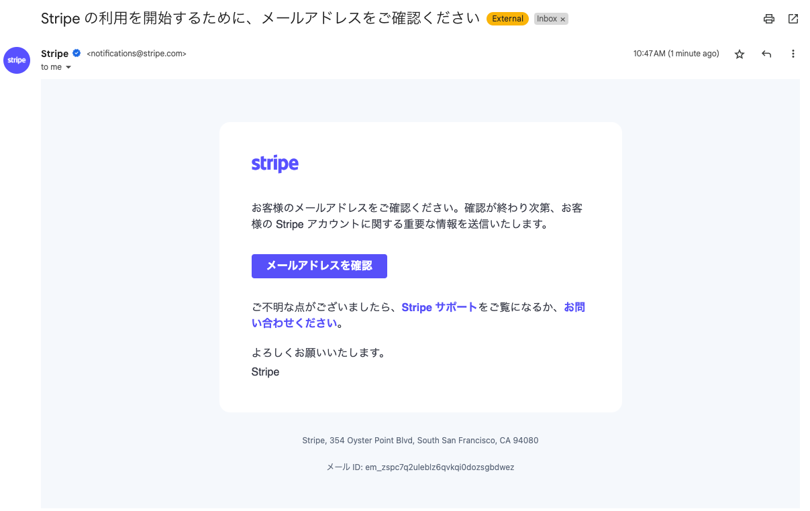

# 決済機能

> [Stripe API Reference](https://stripe.com/docs/api?lang=ruby)
> [Stripe Docs](https://stripe.com/docs)

## 事前準備

今回は、Stripeというサービスを使って決済機能を実装します。

[https://stripe.com/jp](https://stripe.com/jp)


### Stripeアカウントの作成

#### 1. Stripeで登録する

以下のStripeアカウント登録画面からアカウントを作成します。

[https://dashboard.stripe.com/register](https://dashboard.stripe.com/register)



入力したアカウントにメールが届くので、メール内のリンクをクリックしてアカウントを有効化します。



#### 2. APIキーの取得

テストモードに切り替えて、テスト用のAPIキーを取得します。

PublicキーとSecretキーの2種類がありますが、2種類とも使いますので、メモしておいてください。

[https://dashboard.stripe.com/test/apikeys](https://dashboard.stripe.com/test/apikeys)

## ライブラリをGemfileに追加する

Gemfileに、Stripeのgemを追加します。

> [Github: stripe-ruby](https://github.com/stripe/stripe-ruby)

```ruby
# =========================================
# ビジネスに関連するもの
# =========================================
gem "stripe"
```

[command]

```bash
bundle install
```

## 秘匿情報用のファイルを設定

[command]

```bash
rm config/master.key
rm config/credentials.yml.enc
```

[command]

以下のコマンドを実行すると、新しいファイルが作成されます。

```bash
EDITOR=vim bin/rails credentials:edit -e development
```

[output]

```console
/workspace# EDITOR=vim bin/rails credentials:edit -e development
Adding config/credentials/development.key to store the encryption key: 528a9463b0e8bc0440f7efc12cca7367

Save this in a password manager your team can access.

If you lose the key, no one, including you, can access anything encrypted with it.

      create  config/credentials/development.key

Ignoring config/credentials/development.key so it won't end up in Git history:

      append  .gitignore
```

[code]

vimが起動するので、以下のように編集します。

入力が終わったら、`:wq`で保存して終了します。

```console
stripe:
  publishable_key: """<Stripeダッシュボードから取得した公開キー>"""
  secret_key: """<Stripeダッシュボードから取得した秘密キー>"""
```

例

```console
stripe:
  publishable_key: pk_test_51NUK3XLQ6aqGA5PKRkYPqeJIMwl0zVSMcujZ4buf1RKC1N7UmDaMFocVqhwZ0uL8gjJtbmUatl045M7Bo0yE61No00mtTjAslk
  secret_key: sk_test_51NUK3XLQ6aqGA5PKuCHIo1N1i7vxQIpjxxMpjl3CZ6PW4Vu2kpmJHYFc0f28HSArDQhM7sHcm3g7zvpdBXlnsSYl004UtKMSo30
```

### 確認

[command]

Railsコンソールを起動して、credentialsを読み込めるか確認します。

```bash
bin/rails c
```

[command]

`config/credentials.yml.enc`の暗号化された情報を取得するには、`Rails.application.credentials`を実行します。

```ruby
Rails.application.credentials
Rails.application.credentials.stripe
Rails.application.credentials.stripe.public_key
```

[command]

`Rails.application.credentials.stripe`を実行すると、以下のように表示されます。

```ruby
pry(main)> Rails.application.credentials.stripe
=> {:public_key=>
  "pk_test_51NUK3XLQ6aqGA5PKRkYPqeJIMwl0zVSMcujZ4buf1RKC1N7UmDaMFocVqhwZ0uL8gjJtbmUatl045M7Bo0yE61No00mtTjAslk",
 :secret_key=>
  "sk_test_51NUK3XLQ6aqGA5PKuCHIo1N1i7vxQIpjxxMpjl3CZ6PW4Vu2kpmJHYFc0f28HSArDQhM7sHcm3g7zvpdBXlnsSYl004UtKMSo30"}
```

## 設定ファイルの作成

[command]

`config/initializers`ディレクトリに、`stripe.rb`というファイルを作成します。

```bash
touch config/initializers/stripe.rb
```

[code]

`config/initializers/stripe.rb`に以下を追加します。

```ruby
# frozen_string_literal: true

### Stripe::StripeConfigurationをオーバーライドして、Rails.application.credentialsから秘匿情報をセットする
module Stripe
  class StripeConfiguration
    def api_key=(key_value)
      @api_key = key_value || Rails.application.credentials.stripe.secret_key
    end
  end
end

Rails.configuration.stripe = {
  publishable_key: Rails.application.credentials.stripe.publishable_key,
  secret_key: Rails.application.credentials.stripe.secret_key
}

Stripe.api_key = Rails.configuration.stripe[:secret_key]
Stripe.api_version = "2022-11-15"
```

[command]

```bash
bin/rails c
```

[code]

```ruby
Stripe.api_key
#=> "sk_test_51NUK3XLQ6aqGA5PKuCHIo1N1i7vxQIpjxxMpjl3CZ6PW4Vu2kpmJHYFc0f28HSArDQhM7sHcm3g7zvpdBXlnsSYl004UtKMSo30"
```

これで、StripeのAPIを使う準備が整いました。

## Customerを作成する

[code]

```ruby
# frozen_string_literal: true

require "stripe"

module StripeCore
  class Customer
    def self.create
      Stripe::Customer.create(
        {
          preferred_locales: ["ja-JP"],
          email: "info@mycms.com",
          name: "My CMS管理者",
          description: "My First Test Customer (created for API docs at https://www.stripe.com/docs/api)",
          metadata: {
            admin_id: 1
          }
        }
      )
    end
  end
end
```

[command]

Railsコンソールを起動して、`StripeCore::Customer.create`を実行します。

```bash
bin/rails c
```

[code]

```ruby
StripeCore::Customer.create
```

[output]

```console
/workspace# bin/rails c
Loading development environment (Rails 7.0.3)
pry(main)> StripeCore::Customer.create
=> #<Stripe::Customer:0x1151c id=cus_OGw7VTYwjcSDWw> JSON: {
  "id": "cus_OGw7VTYwjcSDWw",
  "object": "customer",
  "address": null,
  "balance": 0,
  "created": 1689488171,
  "currency": null,
  "default_source": null,
  "delinquent": false,
  "description": "My First Test Customer (created for API docs at https://www.stripe.com/docs/api)",
  "discount": null,
  "email": "info@mycms.com",
  "invoice_prefix": "9FCEB8AF",
  "invoice_settings": {"custom_fields":null,"default_payment_method":null,"footer":null,"rendering_options":null},
  "livemode": false,
  "metadata": {"admin_id":"1"},
  "name": "My CMS管理者",
  "next_invoice_sequence": 1,
  "phone": null,
  "preferred_locales": [
    "ja-JP"
  ],
  "shipping": null,
  "tax_exempt": "none",
  "test_clock": null
}
```

ダッシュボードを確認する。

## Customerからカード情報を作成する

> [Stripe Docs: Create a card](https://stripe.com/docs/api/cards/create)

[code]

```ruby
class Customer
  def self.create_source(customer_id)
    Stripe::Customer.create_source(
      customer_id,
      { source: "tok_visa" }
    )
  end
end
```

[command]

Railsコンソールを起動して、`StripeCore::Customer.create_source`を実行します。

```bash
bin/rails c
```

[code]

```ruby
StripeCore::Customer.create_source("cus_OGw7VTYwjcSDWw")
```

[output]

```console
/workspace# bin/rails c
Loading development environment (Rails 7.0.3)
[1] pry(main)> StripeCore::Customer.create_source("cus_OGw7VTYwjcSDWw")
=> #<Stripe::Card:0x1151c id=card_1NUOOlLQ6aqGA5PKYoYLQZWy> JSON: {
  "id": "card_1NUOOlLQ6aqGA5PKYoYLQZWy",
  "object": "card",
  "address_city": null,
  "address_country": null,
  "address_line1": null,
  "address_line1_check": null,
  "address_line2": null,
  "address_state": null,
  "address_zip": null,
  "address_zip_check": null,
  "brand": "Visa",
  "country": "US",
  "customer": "cus_OGw7VTYwjcSDWw",
  "cvc_check": null,
  "dynamic_last4": null,
  "exp_month": 7,
  "exp_year": 2024,
  "fingerprint": "E0ZfxYqjvPhjsTOv",
  "funding": "credit",
  "last4": "4242",
  "metadata": {},
  "name": null,
  "tokenization_method": null,
  "wallet": null
}
```

ダッシュボードを確認する。

## Chargeを作成する

[code]

`lib/stripe_core.rb`に、`Charge`クラスを作成します。

```ruby
# frozen_string_literal: true

require "stripe"

module StripeCore
  class Charge
    def self.create(customer_id)
      Stripe::Charge.create(
        amount: 2000,
        currency: "jpy",
        customer: customer_id,
        description: "My First Test Charge (created for API docs at https://www.stripe.com/docs/api)",
        metadata: {
          user_id: 1,
          book_id: 1
        }
      )
    end
  end
end
```

[command]

Railsコンソールを起動して、`StripeCore::Charge.create`を実行します。

```bash
bin/rails c
```

[code]

```ruby
StripeCore::Charge.create("cus_OGw7VTYwjcSDWw")
```

[output]

以下のようなJSONが戻ってくれば成功です。Stripeのダッシュボードで確認してみましょう。

```console
/workspace# bin/rails c
Loading development environment (Rails 7.0.3)
[1] pry(main)> StripeCore::Charge.create("cus_OGw7VTYwjcSDWw")
=> #<Stripe::Charge:0x1151c id=ch_3NUORvLQ6aqGA5PK1TyDs95v> JSON: {
  "id": "ch_3NUORvLQ6aqGA5PK1TyDs95v",
  "object": "charge",
  "amount": 2000,
  "amount_captured": 2000,
  "amount_refunded": 0,
  "application": null,
  "application_fee": null,
  "application_fee_amount": null,
  "balance_transaction": "txn_3NUORvLQ6aqGA5PK1V5XT7KW",
  "billing_details": {"address":{"city":null,"country":null,"line1":null,"line2":null,"postal_code":null,"state":null},"email":null,"name":null,"phone":null},
  "calculated_statement_descriptor": "OH MY LIKE",
  "captured": true,
  "created": 1689488935,
  "currency": "jpy",
  "customer": "cus_OGw7VTYwjcSDWw",
  "description": "My First Test Charge (created for API docs at https://www.stripe.com/docs/api)",
  "destination": null,
  "dispute": null,
  "disputed": false,
  "failure_balance_transaction": null,
  "failure_code": null,
  "failure_message": null,
  "fraud_details": {},
  "invoice": null,
  "livemode": false,
  "metadata": {"book_id":"1","user_id":"1"},
  "on_behalf_of": null,
  "order": null,
  "outcome": {"network_status":"approved_by_network","reason":null,"risk_level":"normal","risk_score":37,"seller_message":"Payment complete.","type":"authorized"},
  "paid": true,
  "payment_intent": null,
  "payment_method": "card_1NUOOlLQ6aqGA5PKYoYLQZWy",
  "payment_method_details": {"card":{"brand":"visa","checks":{"address_line1_check":null,"address_postal_code_check":null,"cvc_check":null},"country":"US","exp_month":7,"exp_year":2024,"fingerprint":"E0ZfxYqjvPhjsTOv","funding":"credit","installments":null,"last4":"4242","mandate":null,"network":"visa","network_token":{"used":false},"three_d_secure":null,"wallet":null},"type":"card"},
  "receipt_email": null,
  "receipt_number": null,
  "receipt_url": "https://pay.stripe.com/receipts/payment/CAcaFwoVYWNjdF8xTlVLM1hMUTZhcUdBNVBLKKiczqUGMgY4n26pK546LBa2yiL8120g8JOHE1j6MJ1n1JPylN13T7CKD7CLyAJSu9yVUoLdhvuaQd91",
  "refunded": false,
  "review": null,
  "shipping": null,
  "source": {"id":"card_1NUOOlLQ6aqGA5PKYoYLQZWy","object":"card","address_city":null,"address_country":null,"address_line1":null,"address_line1_check":null,"address_line2":null,"address_state":null,"address_zip":null,"address_zip_check":null,"brand":"Visa","country":"US","customer":"cus_OGw7VTYwjcSDWw","cvc_check":null,"dynamic_last4":null,"exp_month":7,"exp_year":2024,"fingerprint":"E0ZfxYqjvPhjsTOv","funding":"credit","last4":"4242","metadata":{},"name":null,"tokenization_method":null,"wallet":null},
  "source_transfer": null,
  "statement_descriptor": null,
  "statement_descriptor_suffix": null,
  "status": "succeeded",
  "transfer_data": null,
  "transfer_group": null
}
```

ダッシュボードを確認する。

## Refundを作成する

[code]

`lib/stripe_core.rb`に、`Refund`クラスを作成します。

```ruby
# frozen_string_literal: true

require "stripe"

module StripeCore
  class Refund
    def self.create(charge_id)
      Stripe::Refund.create(
        {
          charge: charge_id
        }
      )
    end
  end
end
```

[command]

Railsコンソールを起動して、`StripeCore::Refund.create`を実行します。

```bash
bin/rails c
```

[code]

```ruby
StripeCore::Refund.create("ch_3NUORvLQ6aqGA5PK1TyDs95v")
```

[output]

```console
/workspace# bin/rails c
Loading development environment (Rails 7.0.3)
[1] pry(main)> StripeCore::Refund.create("ch_3NUORvLQ6aqGA5PK1TyDs95v")
=> #<Stripe::Refund:0x11530 id=re_3NUORvLQ6aqGA5PK13KYgtGy> JSON: {
  "id": "re_3NUORvLQ6aqGA5PK13KYgtGy",
  "object": "refund",
  "amount": 2000,
  "balance_transaction": "txn_3NUORvLQ6aqGA5PK10GZV244",
  "charge": "ch_3NUORvLQ6aqGA5PK1TyDs95v",
  "created": 1689494591,
  "currency": "jpy",
  "metadata": {},
  "payment_intent": null,
  "reason": null,
  "receipt_number": null,
  "source_transfer_reversal": null,
  "status": "succeeded",
  "transfer_reversal": null
}
```

ダッシュボードを確認する。
