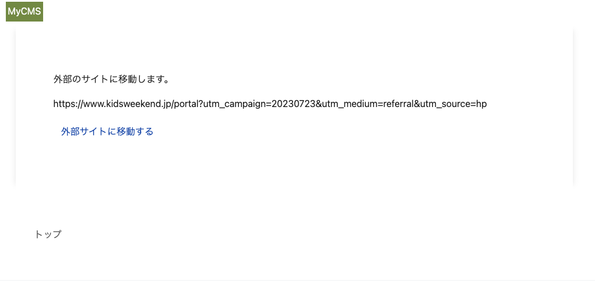

# Day3: 短縮URLトラッキング機能

機能要件を再掲します。

- インプレッション数、クリック数のカウントをすることができます
- インプレッション数、クリック数は、Redisを用いて一時保存し、定期的にDBできるように、バッチ処理を実装します

## Redisの説明と使用目的

Redisは、インメモリ型のデータベースです。今回は、インプレッション数、クリック数をカウントするために使用します。
インプレッション数、クリック数をカウントするために、毎回データベースに保存すると、データベースに負荷がかかります。
一時的なデータを保存するために、Redisを使用して、定期的にデータベースに保存するようにします。

## Redisサーバーの設定

ターミナルで、以下のコマンドを実行します。

```bash
apt-get update && apt-get install -y redis-server
```

### Dockerfileを更新

L12行目の最後に、`redis-server`を追加します。

```dockerfile
RUN apt-get update -qq && apt-get install -y build-essential nodejs yarn vim zlib1g-dev liblzma-dev patch redis-server
```

### entrypoint.local.shを更新

Filename: `entrypoint.local.sh`

```sh
#!/bin/bash
set -e

redis-server --daemonize yes

# https://github.com/evanw/esbuild/issues/1511

# yarn build --watch < /dev/zero & yarn build:css --watch & bundle exec rails s -b 0.0.0.0
yarn build --watch < /dev/zero & yarn build:css --watch
```

## Redisサーバーの起動を確認する

```bash
redis-server
```

以下のように表示されればOKです。

```console
/workspace# redis-server
14247:C 30 Jul 2023 15:31:58.500 # oO0OoO0OoO0Oo Redis is starting oO0OoO0OoO0Oo
14247:C 30 Jul 2023 15:31:58.500 # Redis version=6.0.16, bits=64, commit=00000000, modified=0, pid=14247, just started
14247:C 30 Jul 2023 15:31:58.500 # Warning: no config file specified, using the default config. In order to specify a config file use redis-server /path/to/redis.conf
                _._                                                  
           _.-``__ ''-._                                             
      _.-``    `.  `_.  ''-._           Redis 6.0.16 (00000000/0) 64 bit
  .-`` .-```.  ```\/    _.,_ ''-._                                   
 (    '      ,       .-`  | `,    )     Running in standalone mode
 |`-._`-...-` __...-.``-._|'` _.-'|     Port: 6379
 |    `-._   `._    /     _.-'    |     PID: 14247
  `-._    `-._  `-./  _.-'    _.-'                                   
 |`-._`-._    `-.__.-'    _.-'_.-'|                                  
 |    `-._`-._        _.-'_.-'    |           http://redis.io        
  `-._    `-._`-.__.-'_.-'    _.-'                                   
 |`-._`-._    `-.__.-'    _.-'_.-'|                                  
 |    `-._`-._        _.-'_.-'    |                                  
  `-._    `-._`-.__.-'_.-'    _.-'                                   
      `-._    `-.__.-'    _.-'                                       
          `-._        _.-'                                           
              `-.__.-'                                               

14247:M 30 Jul 2023 15:31:58.509 # Server initialized
14247:M 30 Jul 2023 15:31:58.514 * Ready to accept connections
```

Ctrl + CでRedisサーバーを停止します。

## Redis用の秘匿情報を設定

```bash
EDITOR=vim bin/rails credentials:edit -e development
```

```vim
redis:
  host: 127.0.0.1
  port: 6379
```

### Redisの接続確認

`redis-server`を起動します。

```bash
redis-server --daemonize yes
```

RailsコンソールからRedisに接続できることを確認します。

```bash
bin/rails c
```

Redisクライアントを作成するコードを実行します。

```ruby
Redis.current
=> #<Redis client v4.5.1 for redis://127.0.0.1:6379/0>
```

OKの場合はRedisに接続できています。

```ruby
Redis.current.set("test", "test")
#=> "OK"
```

上記でRedisに保存した値を取得する場合は、以下のコードを実行します。

```ruby
Redis.current.get("test")
#=> "test"
```

※Redisには色んな関数が用意されています。詳しくは、[https://github.com/redis/redis-rb](https://github.com/redis/redis-rb)を参照してください。

## Redisのラッパークラスを作成

`lib`ディレクトリ以下に作成していきます。

```bash
mkdir -p lib/cms_redis && touch lib/cms_redis/core.rb
```

以下のように編集します。

Filename: `lib/cms_redis/core.rb`

```ruby
# frozen_string_literal: true

module CmsRedis
  module Core
    RAILS_MAX_THREADS = 16
    REDIS_TIMEOUT = 1
    EXPIRES = 60 * 60

    class Pool
      class Wrapper < ::ConnectionPool::Wrapper
        def initialize(pool)
          @pool = pool
        end
      end

      class << self
        def with(&block)
          pool.with(&block)
        end

        def connect
          Wrapper.new(pool)
        end

        private

        def pool
          @pool ||= ::ConnectionPool.new(
            size: ENV.fetch("RAILS_MAX_THREADS", RAILS_MAX_THREADS).to_i,
            timeout: ENV.fetch("REDIS_TIMEOUT", REDIS_TIMEOUT).to_i
          ) do
            ::Redis.new(Rails.application.credentials.redis.try(&:to_h))
          end
        end
      end
    end

    class Client
      # Redisクライアントを初期化する
      def initialize(cache_key = "", expires = EXPIRES)
        @connection = ::CmsRedis::Core::Pool.connect
        @cache_key = cache_key
        @expires = expires
      end

      # Redisに保存されている値を取得する&整形する
      def fetch
        return_array_with_sym = array_with_sym
        return return_array_with_sym unless return_array_with_sym.blank?

        return unless block_given?

        array = yield

        set(array)
        array_with_sym
      end

      # Redisに保存されている値を取得する
      def get
        @connection.get(@cache_key)
      end

      # Redisに保存する。その際、有効期限を設定する
      def set(array)
        @connection.with do |redis|
          redis.set(@cache_key, array.to_json)
          redis.expire(@cache_key, @expires)
        end
      end

      # Redisに保存されている値を削除する
      def del
        @connection.del(@cache_key)
      end

      # Redisにキャッシュされているかどうかを判定する
      def cache?
        get.present?
      end

      # Redisに保存されている値を取得し、JSONをパースして返す
      def array_with_sym
        result = get
        array = ["[]", nil].include?(result) ? [] : result
        return [] if array.blank?

        JSON.parse(array, { symbolize_names: true })
      end
    end
  end
end
```

## RailsコンソールからラッパークラスからRedisに接続できることを確認

```bash
bin/rails c
```

Railsコンソールでコードを実行してみましょう。

```ruby
client = CmsRedis::Core::Client.new("test")
client.set("test")
#=> true
client.get
# => "\"test\""
client.fetch
#=> "test"
client.del
#=> 1
client.fetch
#=> nil
client.set([1])
#=> true
client.fetch
#=> [1]
```

## インプレッション数、クリック数のカウント方針

- キャッシュキー`short-url:#{id}`を作成する
- キャッシュする値は、`[{:short_url_id=>"ae8c2bec-9f69-4de2-bdfb-7dbf453ed3aa", :tracking_type=>"imp", :created_at=>1690700669}, {...}]`のような形式で保存する
- キャッシュするcreated_atは、`Time.now.to_i`で保存する

## マイグレーション

ターミナルで、以下のコマンドを実行します。

```bash
bin/rails g migration CreateShortUrlTrackings
```

以下のように編集します。

Filename: `db/migrate/..._short_url_tracking.rb`

```ruby
# frozen_string_literal: true

class CreateShortUrlTracking < ActiveRecord::Migration[7.0]
  def change
    create_table :short_url_trackings, id: :uuid do |t|
      t.references :short_url, foreign_key: true, deferrable: :deferred, type: :uuid, comment: "ShortUrlテーブルの外部キー"
      t.enum :tracking_type, enum_type: :tracking_type, default: :imp, comment: "追跡タイプ"
      t.datetime :created_at, null: false
    end
  end
end
```

マイグレーションを実行します。

```bash
bin/rails db:migrate
```

## ShortUrlTrackingモデルを作成

ShortUrlTrackingモデルを作成します。ターミナルで、以下のコマンドを実行します。

```bash
touch app/models/short_url_tracking.rb
```

以下のように編集します。

Filename: `app/models/short_url_tracking.rb`

```ruby
# frozen_string_literal: true

class ShortUrlTracking < ApplicationRecord
  belongs_to :short_url

  enum tracking_type: {
    imp: "imp",
    click: "click"
  }

  scope :when_created_at, ->(date) { where(created_at: date.beginning_of_day..date.end_of_day) }

  # キャッシュに保存されている値を取得して、データベースに保存する
  def self.import_all!
    targets = ShortUrl.fetch_all_from_redis.map { |hash| hash_to_attribute(hash) }
    result = import targets
    ShortUrl.del_all_redis if result.ids.present?
  end

  # キャッシュに保存されている値から、インスタンスを作成する
  def self.hash_to_attribute(hash)
    new(
      short_url_id: hash[:short_url_id],
      tracking_type: hash[:tracking_type],
      created_at: DateTime.strptime(hash[:created_at].to_s, "%s")
    )
  end

  # 今日作成されたデータを取得する
  def self.created_today
    when_created_at(Date.today)
  end
end
```

## ShortUrlモデルの修正

```ruby
# frozen_string_literal: true

class ShortUrl < ApplicationRecord
  belongs_to :admin
  has_many :short_url_trackings

  validates :label_name, length: { maximum: 255, too_long: "最大%<count>s文字まで使えます" }, presence: true
  validates :original_url, presence: true
  validates :utm_source, presence: true, length: { maximum: 255, too_long: "最大%<count>s文字まで使えます" }, presence: true
  validates :utm_medium, presence: true, length: { maximum: 255, too_long: "最大%<count>s文字まで使えます" }, presence: true
  validates :utm_campaign, presence: true, length: { maximum: 255, too_long: "最大%<count>s文字まで使えます" }, presence: true

  before_create :fill_custom_key

  IMP = "imp"
  CLICK = "click"

  def fill_custom_key
    self.custom_key = loop do
      uuid = SecureRandom.alphanumeric(10) # JWlXD6cCxM
      break uuid unless self.class.exists?(custom_key: uuid)
    end
  end

  def short_url
    Rails.application.routes.url_helpers.short_url_url(
      id: custom_key,
      host: Rails.application.routes.default_url_options[:host],
      protocol: Rails.application.routes.default_url_options[:protocol]
    )
  end

  def parameter_url
    query = {
      utm_source: self&.utm_source,
      utm_medium: self&.utm_medium,
      utm_campaign: self&.utm_campaign
    }
    uri = URI.parse(self&.original_url)
    uri.query = query.to_param
    uri.to_s
  end

  # インプレッション数をカウントする
  def imp!
    tracking_to_redis!(tracking_type: IMP)
  end

  # クリック数をカウントする
  def click!
    tracking_to_redis!(tracking_type: CLICK)
  end

  # キャッシュキーを作成する
  def tracking_cache_key
    "#{::CmsRedis::ShortUrl::CACHE_KEY}:#{id}"
  end

  # Redisに接続する
  def connect_redis
    ::CmsRedis::ShortUrl.new(tracking_cache_key)
  end

  # Redisに保存する
  def tracking_to_redis!(tracking_type: IMP)
    hash = {
      short_url_id: id,
      tracking_type: tracking_type,
      created_at: Time.current.to_i
    }
    connect_redis.set(hash)
  end

  # Redisから取得する
  def fetch_from_redis
    connect_redis.fetch
  end

  # Redisから全て取得する
  def self.fetch_all_from_redis
    all.map do |short_url|
      short_url&.fetch_from_redis
    end.flatten
  end

  # Redisから削除する
  def del_redis
    connect_redis.del
  end

  # Redisから全て削除する
  def self.del_all_redis
    all.map do |del_redis|
      del_redis&.del_redis
    end
  end
end
```

## ShortUrlTrackingを使用して、インプレッション数、クリック数をカウントする

Railsコンソールを起動します。

```bash
bin/rails c
```

以下のコードを実行します。

```ruby
ShortUrl.last.imp!
#=> true
ShortUrl.last.click!
#=> true
ShortUrl.last.fetch_from_redis
#=> [{:short_url_id=>"ae8c2bec-9f69-4de2-bdfb-7dbf453ed3aa", :tracking_type=>"imp", :created_at=>1690701910},
#  {:short_url_id=>"ae8c2bec-9f69-4de2-bdfb-7dbf453ed3aa", :tracking_type=>"click", :created_at=>1690701910}]
```

`imp!`、`click!`メソッドを呼び出すと、Redisに保存され、`fetch_from_redis`メソッドを呼び出すと、Redisに保存されている値を取得できます。

このメソッドをコントローラーで呼び出すことができれば、インプレッション数、クリック数をカウントすることができます。

## ルーティングの設定

インプレッション数、クリック数のカウントをするために、ルーティングを設定します。

| パス | 説明 |
|-----|-----|
| `/l/:id` | 確認画面、インプレッション数のカウント |
| `/l/:id/click` | クリック数のカウント、リダイレクト |

```bash
touch config/routes/user/short_urls.rb
```

Filename: `config/routes/user/short_urls.rb`

```ruby
# frozen_string_literal: true

Rails.application.routes.draw do
  get "/l/:id" => "user/short_urls#show", as: :short_url
  get "/l/:id/click" => "user/short_urls#click", as: :click_short_url
end
```

`bin/rails routes`でルーティングが設定されていることを確認します。

```bash
bin/rails routes -g short_url
```

以下が表示されればOKです。

```console
           short_url GET    /l/:id(.:format)                     user/short_urls#show
     click_short_url GET    /l/:id/click(.:format)               user/short_urls#click
```

## ShortUrlコントローラー

ユーザー側のコントローラーを作成します。

```bash
touch app/controllers/user/short_urls_controller.rb
```

以下のように編集します。

Filename: `app/controllers/user/short_urls_controller.rb`

```ruby
# frozen_string_literal: true

class User::ShortUrlsController < User::ApplicationController
  def show
    redirect_to root_url and return unless params[:id].present? && params[:id] =~ Regexp.new("\\A[a-zA-Z0-9]{10}+\\z")

    @short_url = ShortUrl.find_by(custom_key: params[:id])
    redirect_to root_url and return unless @short_url.present?

    # imp計測
    @short_url&.imp!
  end

  def click
    redirect_to root_url and return unless params[:id].present? && params[:id] =~ Regexp.new("\\A[a-zA-Z0-9]{10}+\\z")

    @short_url = ShortUrl.find_by(custom_key: params[:id])
    redirect_to root_url and return unless @short_url.present?

    # click計測
    @short_url&.click!

    # click後のリダイレクト
    redirect_to @short_url&.parameter_url, allow_other_host: true
  end
end
```

## 確認画面を作成

```bash
mkdir -p app/views/user/short_urls && touch app/views/user/short_urls/show.html.erb
```

以下のように編集します。

Filename: `app/views/user/short_urls/show.html.erb`

```erb
<main id="kiji-main">
  <div class="container max-width-980">
    <div class="article-main">
      <div class="article-main-content">
        外部のサイトに移動します。
        <div class="article-main-content mt-3">
          <%= @short_url&.parameter_url %>
        </div>
        <div class="article-main-content mt-3">
          <%= link_to click_short_url_path(id: params[:id]), target: "_blank", class: "btn" do %>
            外部サイトに移動する
          <% end %>
        </div>
      </div>
    </div>
    <div class="footer-breadcrumb">
      <ul class="breadcrumb">
        <li>
          <%= link_to user_top_path do %>
            トップ
          <% end %>
        </li>
      </ul>
    </div>
  </div>
</main>
```

## ブラウザで確認してみます

```bash
bin/rails s
```

別ターミナルで、`entrypoint.local.sh`を実行します。

```bash
sh entrypoint.local.sh
```

eg) http://localhost:3000/l/e09i1Zxhye

※管理画面>短縮URL一覧>該当の短縮URL>`短縮URL`の値をコピー(短縮URLを作成していなければ、作成してください。)

以下のような画面になればOKです。



## 再度Railsコンソールで確認

Railsコンソールを起動します。

```bash
bin/rails c
```

ブラウザで確認した短縮URLのインプレッション数、クリック数がカウントされていることを確認します。

```ruby
short_url = ShortUrl.find_by_custom_key("e09i1Zxhye") # 自分の環境の値に変更してください
short_url.fetch_from_redis
#=> [{:short_url_id=>"ae8c2bec-9f69-4de2-bdfb-7dbf453ed3aa", :tracking_type=>"imp", :created_at=>1690701910},
#  {:short_url_id=>"ae8c2bec-9f69-4de2-bdfb-7dbf453ed3aa", :tracking_type=>"click", :created_at=>1690701910},
#  {:short_url_id=>"ae8c2bec-9f69-4de2-bdfb-7dbf453ed3aa", :tracking_type=>"imp", :created_at=>1690702930}]
```

## バッチ処理に必要なコードを実装

※バッチ処理の設定は行いません

```bash
touch lib/tasks/short_url.rake
```

以下のように編集します。

Filename: `lib/tasks/short_url.rake`

```ruby
# frozen_string_literal: true

namespace :short_url do
  desc "Insert short_url_tracking data from redis cache"
  task insert: :environment do |task|
    start_message = "#### START: #{task&.name}. ####"
    puts start_message
    Rails.logger.info start_message

    # インプレッション数、クリック数をRedisからデータベースに保存する
    ShortUrlTracking.import_all!

    end_message = "#### END: #{task&.name}. ####"
    puts end_message
    Rails.logger.info end_message
  end
end
```

ターミナルを開き、コードを実行します。

```bash
bin/rails short_url:insert
#### START: short_url:insert. ####
#### END: short_url:insert. ####
```

データベースを見ると、保存されていることが確認できます。

```bash
bin/rails c

> ShortUrlTracking.all
# =>   ShortUrlTracking Load (0.5ms)  SELECT "short_url_trackings".* FROM "short_url_trackings"
# [#<ShortUrlTracking:0x0000ffffb04eda30
#   id: "538c894f-45d7-46f9-9923-ab3922d98c53",
#   short_url_id: "ae8c2bec-9f69-4de2-bdfb-7dbf453ed3aa",
#   tracking_type: "imp",
#   created_at: Sun, 30 Jul 2023 16:25:10.000000000 JST +09:00>,
#  #<ShortUrlTracking:0x0000ffffb04dbc68
#   id: "4f2512c2-cd8a-4fda-b943-00f15b33cadf",
#   short_url_id: "ae8c2bec-9f69-4de2-bdfb-7dbf453ed3aa",
#   tracking_type: "click",
#   created_at: Sun, 30 Jul 2023 16:25:10.000000000 JST +09:00>,
#  #<ShortUrlTracking:0x0000ffffb04dbba0
#   id: "f841365e-f2f4-43e9-aa03-8cf7bfb85395",
#   short_url_id: "ae8c2bec-9f69-4de2-bdfb-7dbf453ed3aa",
#   tracking_type: "imp",
#   created_at: Sun, 30 Jul 2023 16:42:10.000000000 JST +09:00>,
#  #<ShortUrlTracking:0x0000ffffb04dbad8
#   id: "612767db-bc17-420c-a64e-cdc4fa9dd827",
#   short_url_id: "ae8c2bec-9f69-4de2-bdfb-7dbf453ed3aa",
#   tracking_type: "imp",
#   created_at: Sun, 30 Jul 2023 16:42:15.000000000 JST +09:00>]
```

あとはバッチ処理を設定すれば、定期的にデータベースに保存されます。
※今回は、バッチ処理の設定は行いません
