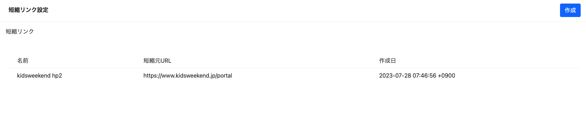
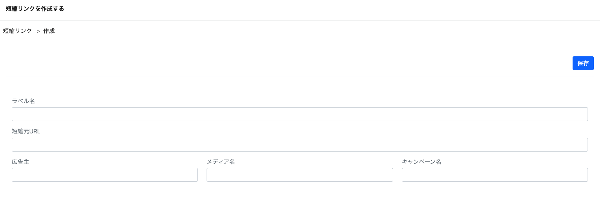
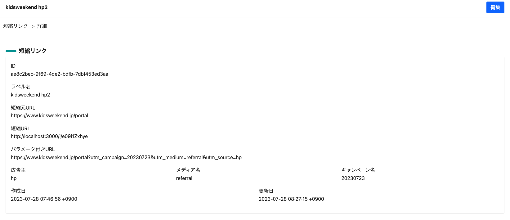
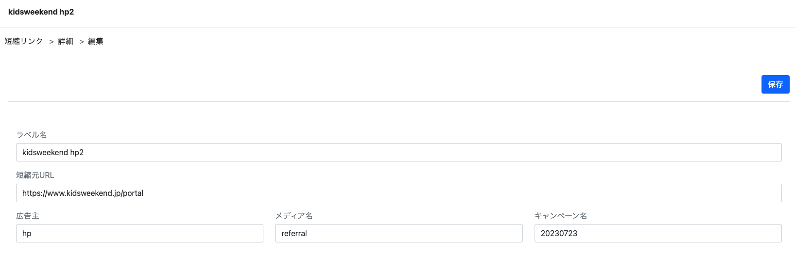

# Day3: 短縮URL管理画面

## マイグレーション

今回、短縮URL `short_url` というモデル名で実装していきます。

マイグレーションファイルを作成します。

```bash
bin/rails g migration CreateShortUrls
```

マイグレーションファイルを以下のように編集します。

```ruby
# frozen_string_literal: true

class CreateShortUrl < ActiveRecord::Migration[7.0]
  def change
    create_table :short_urls, id: :uuid do |t|
      t.references :admin, foreign_key: true, deferrable: :deferred, type: :uuid, comment: "Adminテーブルの外部キー"
      t.string :custom_key, null: false, comment: "カスタムキー"
      t.string :label_name, null: false, comment: "URLラベルネーム"
      t.text :original_url, null: false, comment: "短縮元URL"
      t.string :utm_source, null: false, comment: "GA用参照元"
      t.string :utm_medium, null: false, comment: "GA用メディア"
      t.string :utm_campaign, null: false, comment: "GA用キャンペーン名"
      t.timestamps
    end
  end
end
```

※データ取得でGoogle Analyticsを使用する前提で`utm_`の接頭辞が付くカラムを準備しています。

| カラム名 | 説明 |
|-----|-----|
| admin_id | Adminテーブルの外部キー |
| custom_key | リダイレクト時に使用するキー |
| label_name | 管理画面で使用するラベル名 |
| original_url | 短縮元リンク |
| utm_source | GA用参照元 |
| utm_medium | GA用メディア |
| utm_campaign | GA用キャンペーン名 |

マイグレーションを実行します。

```bash
bin/rails db:migrate
```

## モデル

モデルを作成します。

```bash
touch app/models/short_url.rb
```

以下のように編集します。

```ruby
# frozen_string_literal: true

class ShortUrl < ApplicationRecord
  belongs_to :admin

  validates :label_name, length: { maximum: 255, too_long: "最大%<count>s文字まで使えます" }, presence: true
  validates :original_url, presence: true
  validates :utm_source, presence: true, length: { maximum: 255, too_long: "最大%<count>s文字まで使えます" }, presence: true
  validates :utm_medium, presence: true, length: { maximum: 255, too_long: "最大%<count>s文字まで使えます" }, presence: true
  validates :utm_campaign, presence: true, length: { maximum: 255, too_long: "最大%<count>s文字まで使えます" }, presence: true

  before_create :fill_custom_key

  def fill_custom_key
    self.custom_key = loop do
      uuid = SecureRandom.alphanumeric(10) # JWlXD6cCxM
      break uuid unless self.class.exists?(custom_key: uuid)
    end
  end

  def short_url
    Rails.application.routes.url_helpers.short_url_url(
      id: custom_key,
      host: Rails.application.routes.default_url_options[:host],
      protocol: Rails.application.routes.default_url_options[:protocol]
    )
  end

  def parameter_url
    query = {
      utm_source: self&.utm_source,
      utm_medium: self&.utm_medium,
      utm_campaign: self&.utm_campaign
    }
    uri = URI.parse(self&.original_url)
    uri.query = query.to_param
    uri.to_s
  end
end
```

## ルーティング

続いて管理画面用のルーティングを設定していきます。

```bash
touch config/routes/admin/short_urls.rb
```

以下のように編集します。

```ruby
# frozen_string_literal: true

Rails.application.routes.draw do
  namespace :admin do
    resources :short_urls
  end
end
```

## コントローラー

続いてコントローラーを作成します。

```bash
touch app/controllers/admin/short_urls_controller.rb
```

以下のように編集します。

```ruby
# frozen_string_literal: true

class Admin::ShortUrlsController < Admin::ApplicationController
  def index
    @short_urls = ShortUrl.all
  end

  def show
    @short_url = ShortUrl.find(params[:id])
  end

  def new
    @short_url = ShortUrl.new
  end

  def create
    @short_url = ShortUrl.new(create_params)
    if @short_url.save
      flash.now.notice = t("admin.create.success")
      redirect_to admin_short_urls_path
    else
      flash.now.alert = t("admin.create.failed")
      render :new, status: :unprocessable_entity
    end
  end

  def edit
    @short_url = ShortUrl.find(params[:id])
  end

  def update
    @short_url = ShortUrl.find(params[:id])
    if @short_url.update(update_params)
      flash.now.notice = t("admin.update.success")
      redirect_to admin_short_url_path
    else
      flash.now.alert = t("admin.update.failed")
      render :edit, status: :unprocessable_entity
    end
  end

  private

  def create_params
    params.require(:short_url).permit(
      :admin_id,
      :label_name,
      :original_url,
      :utm_source,
      :utm_medium,
      :utm_campaign
    )
  end

  def update_params
    create_params
  end
end
```

## 翻訳設定の追加

翻訳設定を追加しておきます。

Filename: `config/locales/models/ja.yml`

```yaml
short_url:
  id: ID
  custom_id: カスタムKey
  label_name: ラベル名
  original_url: 短縮元URL
  short_url: 短縮URL
  parameter_url: パラメータ付きURL
  utm_source: 広告主
  utm_medium: メディア名
  utm_campaign: キャンペーン名
```

Filename: `config/locales/views/admin/ja.yml`

```yaml
short_urls:
  breadcrumb:
    index:
      title: 短縮リンク
    new:
      title: 新規作成
  index:
    title: 短縮リンク設定
  new:
    title: 短縮リンクを作成する
```

## ビュー

まず一覧画面を作成します。

※サイドメニューに「短縮URL」を追加する場合は、ご自分で追加ください

```bash
mkdir -p app/views/admin/short_urls && mkdir -p app/views/admin/short_urls/breadcrumb && touch app/views/admin/short_urls/breadcrumb/_index.html.erb && touch app/views/admin/short_urls/index.html.erb && touch app/views/admin/short_urls/_index_table.html.erb
```


### 一覧画面

以下のように編集します。

Filename: `app/views/admin/short_urls/index.html.erb`

```erb
<div class="l-container">
  <%= render partial: "layouts/admin/article_menu" %>
  <div class="l-main-view">
    <div class="sw-main-header">
      <div class="sw-main-header-title">
        <%= t ".title" %>
      </div>
      <div class="sw-main-header-buttons">
        <div class="sw-main-header-button">
          <%= link_to new_admin_short_url_path, class: "btn btn-primary" do %>
            <%= t "buttons.create" %>
          <% end %>
        </div>
      </div>
    </div>
    <div class="sw-main-body">
      <ul class="breadcrumb p-3">
        <%= render partial: "admin/short_urls/breadcrumb/index" %>
      </ul>
      <%= render partial: "admin/short_urls/index_table" %>
    </div>
  </div>
</div>
```

### 一覧テーブル

Filename: `app/views/admin/short_urls/_index_table.html.erb`

```erb
<div class="sw-main-body-table table-responsive">
  <table>
    <thead>
      <tr>
        <th></th>
        <th>名前</th>
        <th>短縮元URL</th>
        <th>作成日</th>
      </tr>
    </thead>
    <tbody>
      <% @short_urls.each do |short_url| %>
        <tr>
          <td class="rowlink">
            <%= link_to admin_short_url_path(id: short_url&.id) do %>
            <% end %>
          </td>
          <td style="min-width: 100px;">
            <%= short_url&.label_name %>
          </td>
          <td style="min-width: 100px;">
            <%= short_url&.original_url %>
          </td>
          <td style="min-width: 150px;">
            <%= short_url&.created_at %>
          </td>
        </tr>
      <% end %>
    </tbody>
  </table>
</div>
```

### 一覧画面のパンくずリスト

Filename: `app/views/admin/short_urls/breadcrumb/_index.html.erb`

```erb
<li>
  <%= link_to admin_short_urls_path do %>
    <%= t ".title" %>
  <% end %>
</li>
```

以下にアクセスしてみます。

http://127.0.0.1:3000/admin/short_urls




### 作成画面

作成画面ファイルを作成します。

```bash
touch app/views/admin/short_urls/new.html.erb && touch app/views/admin/short_urls/_form_attributes.html.erb && touch app/views/admin/short_urls/breadcrumb/_new.html.erb
```

### 作成画面

```erb
<div class="l-container">
  <%= render partial: "layouts/admin/article_menu" %>
  <div class="l-main-view">
    <div class="sw-main-header">
      <div class="sw-main-header-title">
        <%= t ".title" %>
      </div>
    </div>
    <div class="sw-main-body">
      <ul class="breadcrumb p-3">
        <%= render partial: "admin/short_urls/breadcrumb/index" %>
        <%= render partial: "admin/short_urls/breadcrumb/new" %>
      </ul>
      <div class="section">
        <%= render :partial => "admin/flash" %>
      </div>
      <%= render :partial => "admin/short_urls/form_attributes" %>
    </div>
  </div>
</div>
```

### 作成画面のパンくずリスト

```erb
<li>
  <%= link_to new_admin_short_url_path do %>
    <%= t "breadcrumb.new" %>
  <% end %>
</li>
```

### フォーム

```erb
<%= form_with model: [:admin, @short_url], local: true do |f| %>
  <%= f.hidden_field :admin_id, :value => current_admin&.id %>
  <div class="section">
    <div class="d-flex justify-content-between border-bottom pb-3">
      <div></div>
      <div class="d-flex">
        <div>
          <button class="btn btn-primary"><%= t "buttons.save" %></button>
        </div>
      </div>
    </div>
  </div>
  <div class="section">
    <div class="card border-0">
      <div class="card-body">
        <div class="row">
          <div class="col-md-12 mt-3">
            <%= f.label :label_name, class: "mb-1 form-label text-small text-muted" do %>
              <%= t "activerecord.attributes.short_url.label_name" %>
            <% end %>
            <%= f.text_field :label_name, autofocus: true, class: "form-control", placeholder: "" %>
          </div>
        </div>
        <div class="row">
          <div class="col-md-12 mt-3">
            <%= f.label :original_url, class: "mb-1 form-label text-small text-muted" do %>
              <%= t "activerecord.attributes.short_url.original_url" %>
            <% end %>
            <%= f.text_field :original_url, autofocus: true, class: "form-control", placeholder: "" %>
          </div>
        </div>
        <div class="row">
          <div class="col-md-4 mt-3">
            <%= f.label :utm_source, class: "mb-1 form-label text-small text-muted" do %>
              <%= t "activerecord.attributes.short_url.utm_source" %>
            <% end %>
            <%= f.text_field :utm_source, autofocus: true, class: "form-control", placeholder: "" %>
          </div>
          <div class="col-md-4 mt-3">
            <%= f.label :utm_medium, class: "mb-1 form-label text-small text-muted" do %>
              <%= t "activerecord.attributes.short_url.utm_medium" %>
            <% end %>
            <%= f.text_field :utm_medium, autofocus: true, class: "form-control", placeholder: "" %>
          </div>
          <div class="col-md-4 mt-3">
            <%= f.label :utm_campaign, class: "mb-1 form-label text-small text-muted" do %>
              <%= t "activerecord.attributes.short_url.utm_campaign" %>
            <% end %>
            <%= f.text_field :utm_campaign, autofocus: true, class: "form-control", placeholder: "" %>
          </div>
        </div>
      </div>
    </div>
  </div>
<% end %>
```

以下にアクセスしてみます。

※実際に作成してみてください



http://127.0.0.1:3000/admin/short_urls/new

### 詳細画面ファイルを作成

```bash
touch app/views/admin/short_urls/show.html.erb && touch app/views/admin/short_urls/breadcrumb/_show.html.erb
```

### 詳細画面

```erb
<div class="l-container">
  <%= render partial: "layouts/admin/article_menu" %>
  <div class="l-main-view">
    <div class="sw-main-header">
      <div class="sw-main-header-title">
        <%= @short_url&.label_name %>
      </div>
      <div class="sw-main-header-buttons">
        <div class="sw-main-header-button">
          <%= link_to edit_admin_short_url_path, class: "btn btn-primary" do %>
            <%= t "buttons.edit" %>
          <% end %>
        </div>
      </div>
    </div>
    <div class="sw-main-body">
      <ul class="breadcrumb p-3">
        <%= render partial: "admin/short_urls/breadcrumb/index" %>
        <%= render partial: "admin/short_urls/breadcrumb/show" %>
      </ul>
      <div class="section">
        <%= render :partial => "admin/flash" %>
      </div>
      <div class="section">
        <h2 class="admin-title">短縮リンク</h2>
        <div class="card">
          <div class="card-body">
            <div class="row">
              <div class="col-md-6 mb-3">
                <div class="model-key">
                  <%= t "activerecord.attributes.short_url.id" %>
                </div>
                <div class="model-value">
                  <%= @short_url&.id %>
                </div>
              </div>
            </div>
            <div class="row">
              <div class="col-md-6 mb-3">
                <div class="model-key">
                  <%= t "activerecord.attributes.short_url.label_name" %>
                </div>
                <div class="model-value">
                  <%= @short_url&.label_name %>
                </div>
              </div>
            </div>
            <div class="row">
              <div class="col-md-12 mb-3">
                <div class="model-key">
                  <%= t "activerecord.attributes.short_url.original_url" %>
                </div>
                <div class="model-value">
                  <%= @short_url&.original_url %>
                </div>
              </div>
            </div>
            <div class="row">
              <div class="col-md-12 mb-3">
                <div class="model-key">
                  <%= t "activerecord.attributes.short_url.short_url" %>
                </div>
                <div class="model-value">
                  <%= @short_url&.short_url %>
                </div>
              </div>
            </div>
            <div class="row">
              <div class="col-md-12 mb-3">
                <div class="model-key">
                  <%= t "activerecord.attributes.short_url.parameter_url" %>
                </div>
                <div class="model-value">
                  <%= @short_url&.parameter_url %>
                </div>
              </div>
            </div>
            <div class="row">
              <div class="col-md-4 mb-3">
                <div class="model-key">
                  <%= t "activerecord.attributes.short_url.utm_source" %>
                </div>
                <div class="model-value">
                  <%= @short_url&.utm_source %>
                </div>
              </div>
              <div class="col-md-4 mb-3">
                <div class="model-key">
                  <%= t "activerecord.attributes.short_url.utm_medium" %>
                </div>
                <div class="model-value">
                  <%= @short_url&.utm_medium %>
                </div>
              </div>
              <div class="col-md-4 mb-3">
                <div class="model-key">
                  <%= t "activerecord.attributes.short_url.utm_campaign" %>
                </div>
                <div class="model-value">
                  <%= @short_url&.utm_campaign %>
                </div>
              </div>
            </div>
            <div class="row">
              <div class="col-md-6 mb-3">
                <div class="model-key">
                  <%= t "common.created_at" %>
                </div>
                <div class="model-value">
                  <%= @short_url&.created_at %>
                </div>
              </div>
              <div class="col-md-6 mb-3">
                <div class="model-key">
                  <%= t "common.updated_at" %>
                </div>
                <div class="model-value">
                  <%= @short_url&.updated_at %>
                </div>
              </div>
            </div>
          </div>
        </div>
      </div>
    </div>
  </div>
</div>
```

### 詳細画面のパンくずリスト

```erb
<li>
  <%= link_to admin_short_url_path do %>
    <%= t "breadcrumb.show" %>
  <% end %>
</li>
```

以下にアクセスしてみます。

eg) http://127.0.0.1:3000/admin/short_urls/ae8c2bec-9f69-4de2-bdfb-7dbf453ed3aa # ae8c2bec-9f69-4de2-bdfb-7dbf453ed3aaはご自分の環境で作成した短縮URLのIDに置き換えてください



### 編集画面のファイルを作成

```bash
touch app/views/admin/short_urls/edit.html.erb && touch app/views/admin/short_urls/breadcrumb/_edit.html.erb
```

### 編集画面

```erb
<div class="l-container">
  <%= render partial: "layouts/admin/article_menu" %>
  <div class="l-main-view">
    <div class="sw-main-header">
      <div class="sw-main-header-title">
        <%= @short_url&.label_name %>
      </div>
    </div>
    <div class="sw-main-body">
      <ul class="breadcrumb p-3">
        <%= render :partial => "admin/short_urls/breadcrumb/index" %>
        <%= render :partial => "admin/short_urls/breadcrumb/show" %>
        <%= render :partial => "admin/short_urls/breadcrumb/edit" %>
      </ul>
      <div class="section">
        <%= render :partial => "admin/flash" %>
      </div>
      <%= render :partial => "admin/short_urls/form_attributes" %>
    </div>
  </div>
</div>
```

### 編集画面のパンくずリスト

```erb
<li>
  <%= link_to edit_admin_tag_path do %>
    <%= t "breadcrumb.edit" %>
  <% end %>
</li>
```


以下にアクセスしてみます。

eg) http://127.0.0.1:3000/admin/short_urls/ae8c2bec-9f69-4de2-bdfb-7dbf453ed3aa/edit # ae8c2bec-9f69-4de2-bdfb-7dbf453ed3aaはご自分の環境で作成した短縮URLのIDに置き換えてください



これで短縮URLの管理ができるようになりました。

次は短縮URLトラッキング機能について実装していきます。
